# 股票多因子建模与投资前景评价模型说明书

这份说明书不是代码说明，而是用尽量通俗的语言解释：这个股票多因子模型到底在做什么、为什么这样做、每一步怎么理解、最后结果应该怎么写进报告。

本文使用的实际结果主要来自 `outputs_optimized/` 目录，包括最终参数配置、实验日志、前向分步回归结果、PROMETHEE 结果、Top-K 回测结果、评级结果和偏好函数敏感性比较。

## 1. 一句话说明这个项目在做什么

用最简单的话说：

> 我们不是直接预测股票明天涨多少，而是根据公司基本面、宏观环境和模型评分，把同一季度的股票从好到差排队，然后选出排名靠前的一批股票，检验它们后续表现是否更好。

也就是说，本项目的核心不是问：

> “某只股票下一期一定涨多少？”

而是问：

> “在同一个季度里，哪些股票相对更值得关注？哪些股票更适合作为候选投资对象？”

所以本项目做的是一个“投资前景评价框架”。它包含几个连续步骤：

1. 用公司自身数据构造个股因子；
2. 用宏观经济和市场环境数据构造宏观因子；
3. 把个股因子和宏观因子相乘，构造 231 个宏微观综合因子；
4. 用移动窗口前向分步回归从 231 个因子中动态挑选变量；
5. 用入选因子生成股票排序分数；
6. 用熵权-PROMETHEE 计算投资前景值；
7. 构造 Hybrid Score 作为综合评分候选；
8. 按评分生成 13 级评级；
9. 用 Top-K 回测检验高分股票组合后续表现。

## 2. 为什么不能简单理解为收益率预测

很多人第一次看到“预测股票收益率”，会以为模型要精确回答：

> “A 股票下一期涨 3.2%，B 股票下一期涨 1.7%。”

但真实股票市场里，收益率受很多短期因素影响，例如市场情绪、政策消息、行业突发事件、资金流动、投资者预期等。这些因素很难完全被财务因子和宏观因子解释。因此，股票收益率的点预测通常非常 noisy，也就是噪声很大。

这里的“噪声”可以理解为：

> 结果里有很多随机波动，不完全由模型里的变量决定。

所以，即使一个模型的 `R²` 不高，甚至为负，也不一定说明它完全没有价值。

`R²` 是回归模型里常见的指标，意思是：

> 模型能解释真实收益波动的比例。

但是在股票选股任务中，我们更关心的是排序能力，而不是精确数值。举例来说：

> 如果模型不能准确预测 A 股票未来涨 3.2%、B 股票涨 1.7%，但能大致判断 A 比 B 更值得关注，这对选股仍然有意义。

因此，本项目更关注：

- `RankIC`：模型排名和真实收益排名是否一致；
- `Top-K 收益`：模型选出的前 K 只股票后续表现如何；
- `Sharpe`：组合承担单位风险能获得多少收益；
- `Alpha`：组合相对基准是否有超额收益；
- `评级分层`：高评级股票整体是否优于低评级股票。

换句话说，本项目的目标是“把股票排得更合理”，而不是“精确算出每只股票未来收益率”。

## 3. 数据从哪里来

本项目的数据可以分成两大类：个股因子和宏观因子。

### 3.1 个股因子

个股因子代表公司自身情况。可以把它理解成：

> 用一组数字描述一家公司质量、估值、成长和经营状态。

常见含义包括：

- 盈利能力：公司赚钱能力强不强；
- 成长能力：收入、利润是否增长；
- 现金流质量：公司是否真的收到现金，而不是只有账面利润；
- 估值水平：股票价格相对利润、净资产、现金流是贵还是便宜；
- 公司规模：公司市值、流通市值等；
- 运营效率：公司资产和收入使用效率如何。

但是，并不是所有个股字段都能进入模型。收益类字段不能作为解释变量，因为它们和标签非常接近，甚至可能直接包含未来收益信息。

本项目明确不进入模型的字段包括：

- `future_return_1q`；
- `月平均收益率`；
- `区间涨跌幅(1月)`；
- `区间涨跌幅(3月)`；
- `区间涨跌幅(6月)`；
- `股票编号`；
- `证券代码`；
- `证券名称`；
- `quarter_idx`；
- 其他 ID、收益类、标签类、meta 字段。

其中 `future_return_1q` 是正式标签，只能用于训练和事后检验，不能作为模型输入。

### 3.2 宏观因子

宏观因子代表市场大环境。可以理解为：

> 公司不只受到自身经营影响，也受到经济周期、货币环境、市场估值和风险偏好的影响。

本项目实际使用 11 个可识别宏观因子：

| 宏观因子 | 通俗理解 |
|---|---|
| `bm` | 市场账面市值比，可以理解为整体估值状态的一种描述 |
| `de` | 股利支付或股利相关指标，反映市场分红状态 |
| `dp` | 股息价格比，反映股息相对价格的水平 |
| `ep` | 盈利价格比，反映盈利相对价格的水平 |
| `infl` | 通胀水平，反映物价变化 |
| `itgr` | 工业或投资增长相关指标，反映经济活动变化 |
| `m2gr` | M2 货币增速，反映货币环境宽松或收紧 |
| `mtr` | 利率或期限相关变量，反映资金价格环境 |
| `ntis` | 净发行或融资相关指标，反映市场融资状态 |
| `svar` | 市场波动或风险水平 |
| `tms` | 期限利差，反映长短期利率差异 |

不用死记这些缩写。对本项目来说，它们的共同作用是：

> 描述股票所处的市场环境。

## 4. 为什么作业说 276 个综合因子，本文实际用 231 个

作业理论口径是：

> 23 个个股因子 × 12 个宏观因子 = 276 个综合因子。

但是实际做数据审计后发现：

1. 宏观数据中只有 11 个可稳定识别的宏观变量；
2. 第 12 个宏观因子没有清晰字段名、定义和可用数据；
3. 个股数据里有一些收益类字段，不能作为解释变量；
4. 如果为了凑数量把收益类字段放进模型，会造成数据泄漏；
5. 最终可稳定使用的是 21 个非收益型个股因子和 11 个宏观因子；
6. 因此实际构造 `21 × 11 = 231` 个宏微观综合因子。

这不是偷懒，而是为了保证：

- 不把未来收益信息放进模型；
- 不硬凑不存在或不可解释的变量；
- 结果可以复现；
- 符合作业中“不能数据泄漏”的要求。

| 项目 | 作业理论口径 | 实际数据口径 | 本文处理 |
|---|---:|---:|---|
| 个股因子 | 23 | 21 个非收益型因子 | 使用 21 个 |
| 宏观因子 | 12 | 11 个可识别因子 | 使用 11 个 |
| 综合因子 | 276 | 231 | 使用 231 个 |
| 收益类字段 | 未单独说明 | 存在 | 剔除 |

## 5. 什么是宏微观综合因子

宏微观综合因子就是：

> 把公司自身特征和宏观环境结合起来看。

公式是：

```text
composite_factor = 标准化后的个股因子 × 标准化后的宏观因子
```

举例来说，如果一个公司盈利能力很强，同时当前货币增速较高，那么：

```text
盈利能力 × M2 货币增速
```

可以理解为：

> 在当前货币环境下，盈利能力强的公司是否更有投资价值。

为什么要先标准化？

因为不同指标单位完全不一样。比如：

- 市盈率可能是几十倍；
- 现金流可能是几亿元；
- 通胀率可能是几个百分点；
- 市值可能是几百亿。

这些数字不能直接相乘。标准化的作用是把它们转换成相对可比较的分数，再构造交互因子。

本项目最终使用 231 个综合因子，全部来自：

```text
21 个非收益型个股因子 × 11 个宏观因子
```

## 6. 为什么要做前向分步回归

本项目有 231 个候选综合因子，但不能把它们全部塞进模型。

原因很简单：

- 因子太多，容易把噪声也当成规律；
- 因子之间可能高度相关；
- 模型会变得难解释；
- 样本数量有限，变量太多容易过拟合。

“过拟合”可以理解为：

> 模型把历史样本里的偶然现象记住了，但到新样本就不灵了。

前向分步回归的作用是：

> 从 231 个候选因子里，一步一步挑出当前窗口最有用的一小部分。

可以用一个生活化例子理解：

> 就像选队员打比赛，不是一开始把 231 个人全派上场，而是一轮一轮挑最能补强队伍的人。

几个关键概念：

| 概念 | 通俗解释 |
|---|---|
| 候选因子池 | 一开始可供选择的 231 个综合因子 |
| 残差 | 模型当前还没解释掉的误差 |
| 每一步选因子 | 找一个最能解释剩余误差的因子加入模型 |
| 停止条件 | 选够数量，或新增因子带来的提升很小 |
| 滚动选择 | 每个季度都重新用过去窗口选因子 |

本项目最终配置中，前向分步回归最多选择 12 个因子，使用 `residual_correlation` 作为选择目标。它的意思是：

> 每一步优先选择与当前残差最相关的因子。

## 7. 移动窗口是什么意思

移动窗口就是：

> 模型只用过去一段时间的数据来预测下一期，不偷看未来。

本项目时间切分固定为：

- train：`quarter_idx` 1-21；
- valid：`quarter_idx` 22-25；
- test：`quarter_idx` 26-30。

最终配置里：

```text
rolling_window = 12
```

这表示模型每次使用过去 12 个季度作为训练窗口。举例来说：

- 用第 1-12 季数据训练，预测第 13 季；
- 用第 2-13 季数据训练，预测第 14 季；
- 用第 3-14 季数据训练，预测第 15 季；
- 依此类推。

每往后一个季度，窗口就向前滚动一次。

这里最重要的原则是：

> 测试集只能最后检验，不能用来调参数。

也就是说，模型参数要根据训练集和验证集确定，测试集相当于期末考试，不能提前看答案。

## 8. 前向分步回归在本项目里输出什么

前向分步回归不是只输出一个收益预测值，它会输出一整套可解释结果：

1. 每个季度选中了哪些因子；
2. 每个因子的回归系数；
3. 每只股票的 `stagewise_pred`；
4. 每只股票在本季度的 `stagewise_rank`；
5. 每个季度的 `RankIC`；
6. 每个因子被选中的频率。

这些输出分别有不同用途：

- 入选因子用于解释“模型在看什么”；
- `stagewise_pred` 用于给股票排序；
- 高频入选因子可以进入 PROMETHEE 指标池；
- `RankIC` 用于判断排序是否有效。

当前优化结果中，前向分步回归高频入选因子包括：

| 高频因子 | 入选次数 | 简单说明 |
|---|---:|---|
| `composite_净资产收益率_TTM_x_ntis` | 10 | 净资产收益率与融资环境交互 |
| `composite_市净率PB_LF_x_svar` | 9 | 市净率与市场风险波动交互 |
| `composite_净资产收益率_TTM_x_itgr` | 8 | 净资产收益率与增长环境交互 |
| `composite_流通市值_x_svar` | 7 | 流通市值与市场波动交互 |

这说明模型不是固定看某一个指标，而是在不同季度动态筛选变量。

## 9. 什么是 RankIC

`RankIC` 衡量的是：

> 模型排名和真实收益排名是否一致。

举例来说，某季度有 A、B、C 三只股票。

如果模型排序是：

```text
A > B > C
```

之后真实收益排序也是：

```text
A > B > C
```

那么 RankIC 会比较高。

如果真实收益排序反过来：

```text
C > B > A
```

那么 RankIC 可能为负。

可以这样理解：

- `RankIC > 0`：模型有正向排序信号；
- `RankIC < 0`：模型排序可能反了；
- `RankIC 接近 0`：排序信号较弱。

当前优化结果中，前向分步回归平均 RankIC 为：

| 数据区间 | 平均 RankIC |
|---|---:|
| train | -0.0390 |
| valid | 0.1371 |
| test | 0.0649 |

这说明模型在验证集和测试集上有正向排序信号，但信号强度不能夸大。股票收益噪声很大，弱正 RankIC 已经更适合解释为“排序有一定参考价值”，不能解释为“能准确预测收益率”。

## 10. 什么是 PROMETHEE

`PROMETHEE` 是一种多属性决策方法。名字看起来复杂，但思想很直观：

> 不只看一个指标，而是把多个指标放在一起，两两比较股票，判断哪只股票整体更有投资前景。

它的流程可以理解为：

1. 选定一组评价指标；
2. 给每个指标分配权重；
3. 对股票进行两两比较；
4. 计算正流 `phi_plus`；
5. 计算负流 `phi_minus`；
6. 计算净流 `net_flow`；
7. `net_flow` 越高，投资前景越好。

几个关键词：

| 概念 | 通俗解释 |
|---|---|
| 正流 `phi_plus` | 一只股票超过别人的程度 |
| 负流 `phi_minus` | 一只股票被别人超过的程度 |
| 净流 `net_flow` | 综合优势，等于正流减负流 |

如果一只股票在多个指标上经常优于其他股票，它的正流会比较高；如果它经常被其他股票超过，负流会比较高。净流越高，说明综合评价越好。

## 11. 什么是熵权法

熵权法是一种自动确定指标权重的方法。

它的直观思想是：

> 一个指标在股票之间差异越大，说明它越能区分股票，就给它更高权重；如果一个指标大家都差不多，它区分度低，权重就低。

举例来说：

- 如果某个指标所有股票都差不多，那它很难帮助我们区分股票；
- 如果某个指标在不同股票之间差异很大，它可能更有筛选作用。

本项目中，熵权法不使用 `future_return_1q`。它只看指标自身在当期股票之间的离散程度，因此不会泄漏未来收益。

最终配置中，熵权方法是：

```text
entropy_weight_method = smooth_80_20
```

意思是把正常熵权和等权做平滑混合。这样做的好处是：

> 避免某一个指标因为短期差异很大而获得过高权重。

## 12. 本项目 PROMETHEE 的指标从哪里来

本项目不是随便把 231 个因子全部扔进 PROMETHEE。

PROMETHEE 的指标主要来自：

> 前向分步回归筛选出的高频因子或当前窗口入选因子。

这样做有几个原因：

1. 保持 PROMETHEE 和前向分步回归主线一致；
2. 避免 231 个因子全部进入导致噪声过大；
3. 提高解释性；
4. 让多属性评价建立在动态变量选择结果上。

最终配置中：

```text
promethee_top_n = 20
min_selected_count = 2
sign_stability_threshold = 0.55
```

这表示 PROMETHEE 会优先使用入选频率较高、方向相对稳定的一批因子。如果严格条件导致指标过少，程序会自动放宽条件，而不是直接报错。

## 13. PROMETHEE 为什么选择这个偏好函数

PROMETHEE 不只是“把指标加权平均”。它还需要定义一个问题：

> 股票 A 在某个指标上比股票 B 好多少，才算 A 对 B 有偏好？

这个规则叫“偏好函数”。

本项目最终配置中采用：

```text
preference_function = linear
```

也就是带无差异阈值的线性偏好函数。它和 V-shape / 线性偏好函数的思想非常接近：

> A 比 B 高一点点，就只给一点优势；A 比 B 高很多，才给很强优势。

### 13.1 通俗解释

普通偏好函数像是：

> 只要 A 比 B 高一点点，就直接判定 A 完全胜出。

线性偏好函数像是：

> A 比 B 高一点点，就只给一点优势；A 比 B 高很多，才给很强优势。

在股票因子数据中，后者更合理。因为两个股票某个因子相差 `0.01` 和相差 `2.00`，显然不应该被视为同等程度的优势。

### 13.2 本项目实际公式

代码实际采用的是带无差异阈值 `q` 的 Linear Preference Function。

设：

```text
d = g_j(a) - g_j(b)
```

其中：

- `g_j(a)` 表示股票 a 在指标 j 上的标准化得分；
- `g_j(b)` 表示股票 b 在指标 j 上的标准化得分；
- `d` 表示股票 a 相比股票 b 的指标优势。

线性偏好函数为：

```text
P_j(a,b) = 0, 如果 d <= q

P_j(a,b) = (d - q) / (p - q), 如果 q < d < p

P_j(a,b) = 1, 如果 d >= p
```

其中：

- `P_j(a,b)` 表示股票 a 相对于股票 b 在指标 j 上的偏好强度；
- `q` 是无差异阈值；
- `p` 是完全偏好阈值；
- `d <= q` 时，认为差异太小，可以忽略；
- `d >= p` 时，认为优势已经足够明显；
- `P_j(a,b)` 的取值范围是 0 到 1。

本项目代码中的实际参数是：

```text
q = 0.05
p = 0.25
sigma = 0.20
```

其中 `sigma` 只用于 Gaussian Preference Function，高斯偏好函数；最终 linear 偏好函数不使用 `sigma`。

这些阈值作用在已经做过缩尾、方向调整和 0-1 归一化后的 PROMETHEE 指标上。因此 `p = 0.25` 可以理解为：

> 当两个股票在某个指标上的归一化差距达到 0.25 或以上时，就认为优势已经比较明显。

### 13.3 与其他偏好函数相比有什么区别

| 偏好函数 | 通俗解释 | 在本项目中的特点 |
|---|---|---|
| Usual 普通偏好函数 | 只要 A 比 B 好一点点，就认为 A 完全胜出 | 太粗糙，容易放大极小差异 |
| U-shape U 型偏好函数 | 小差异忽略，超过阈值就完全偏好 | 能忽略小噪声，但仍然是跳跃式判断 |
| V-shape V 型偏好函数 | 差一点给小优势，差很多给大优势 | 能保留连续差异，解释清楚 |
| Level 分级偏好函数 | 小差异 0，中等差异 0.5，大差异 1 | 比普通偏好稳健，但仍然比较粗 |
| Linear 线性偏好函数 | 很小差异忽略，中等差异按比例加分，大差异满分 | 本项目最终配置采用，兼顾连续差异和小噪声过滤 |
| Gaussian 高斯偏好函数 | 偏好强度按平滑曲线增加 | 平滑，但 `sigma` 参数不如 q/p 直观 |

### 13.4 本项目数据上的敏感性比较

为了避免只做理论解释，本项目新增了偏好函数敏感性实验：

```text
outputs_optimized/promethee_preference_function_comparison.csv
```

这个实验固定了：

- 同一批前向分步回归筛选因子；
- 同一套熵权方法；
- 同一时间切分；
- 同一 Top-K 评估方式；
- 只改变 PROMETHEE 偏好函数。

验证集上的 PROMETHEE-only 比较结果如下：

| 偏好函数 | Valid RankIC | Top20 年化收益 | Top20 Sharpe | 最大回撤 | 换手率 | 评级区分度 | Top20 与最终函数重合率 |
|---|---:|---:|---:|---:|---:|---:|---:|
| usual | -0.1287 | -3.87% | -0.1478 | -19.04% | 0.5500 | -8.4238 | 0.5500 |
| u_shape | -0.1193 | -22.33% | -0.7818 | -21.79% | 0.4125 | -7.5250 | 0.8375 |
| v_shape | -0.1166 | -16.73% | -0.5514 | -21.01% | 0.3750 | -7.3078 | 0.9375 |
| level | -0.1142 | -18.26% | -0.6275 | -20.70% | 0.3000 | -7.8009 | 0.9375 |
| linear | -0.1055 | -17.18% | -0.5921 | -20.08% | 0.3125 | -6.7088 | 1.0000 |
| gaussian | -0.1021 | -14.70% | -0.5593 | -18.65% | 0.2625 | -7.0107 | 0.8750 |

这张表要谨慎理解：

1. 这是为了比较 PROMETHEE 偏好函数本身，不是最终 Top20 主策略；
2. 在 PROMETHEE-only 结果里，各偏好函数的验证集 RankIC 都为负，说明单独使用 PROMETHEE 分数并不强；
3. Gaussian 在部分 PROMETHEE-only 指标上略好，但参数 `sigma` 不如 q/p 直观；
4. Linear 的评级区分度相对更好，且与最终配置完全一致；
5. 最终主组合方案是 `pure_stagewise_score_top20`，所以 PROMETHEE 偏好函数主要影响投资前景评价、PROMETHEE 对比和 Hybrid 候选，不是最终 Top20 组合收益的唯一来源。

因此，本文最终保留 `linear` 偏好函数，主要原因是：

- 它符合连续型股票因子的特点；
- 它不会把极小差异直接放大成完全偏好；
- q 和 p 参数含义比 Gaussian 的 sigma 更容易解释；
- 它与优化流程中的最终配置一致；
- 它适合作为课程报告中可复现、可说明的 PROMETHEE 主方案。

同时也要如实说明：

> 偏好函数敏感性实验显示，单独使用 PROMETHEE 的排序表现并不强，因此 PROMETHEE 更适合作为多属性投资前景评价和解释工具，而不是替代前向分步回归主线。

## 14. 什么是 Hybrid Score

Hybrid Score 是把两种信息融合起来：

1. 前向分步回归：偏统计预测和排序；
2. PROMETHEE：偏多属性综合评价和可解释性。

以 `hybrid_score_50_50` 为例：

```text
hybrid_score_50_50
= 0.5 × promethee_rank_pct
+ 0.5 × stagewise_rank_pct
```

其中：

- `promethee_rank_pct`：PROMETHEE 分数在本季度的排名分位数；
- `stagewise_rank_pct`：前向分步回归预测分数在本季度的排名分位数；
- 分数越高，股票越靠前。

本项目比较了以下几种分数：

| 名称 | 含义 |
|---|---|
| `pure_stagewise_score` | 只使用前向分步回归排序 |
| `pure_promethee_score` | 只使用 PROMETHEE 排序 |
| `hybrid_score_70_30` | 70% PROMETHEE + 30% 前向分步回归 |
| `hybrid_score_50_50` | 50% PROMETHEE + 50% 前向分步回归 |
| `hybrid_score_30_70` | 30% PROMETHEE + 70% 前向分步回归 |

为什么要比较不同权重？

因为一开始我们不知道应该更相信统计模型，还是更相信多属性评价。用验证集比较，可以减少主观拍脑袋。

当前最终 Top-K 主方案选择的是：

```text
hybrid_score_name = pure_stagewise_score
top_k = 20
```

这并不意味着 PROMETHEE 没有用，而是说明在本次验证集选择规则下，最终组合回测更适合采用前向分步回归排序；PROMETHEE 仍然用于投资前景评价、解释、评级对比和 Hybrid 候选方案比较。

## 15. 为什么不能直接选测试集最好的方案

测试集相当于期末考试。

如果我们看了测试集结果再改模型，就等于：

> 先看答案，再回头改作业。

这会造成过拟合，也就是模型看起来在测试集很好，但其实只是迎合了这一次测试样本。

本项目严格区分：

- `train`：用于模型训练；
- `valid`：用于参数选择；
- `test`：用于最终 holdout 检验。

测试集不能用来调参数。如果测试集表现不好，也必须如实报告，不能删掉失败实验。

最终配置文件中也明确写明：

```text
selection_basis = max valid_score among valid-positive Top20/Top30 candidates; test metrics not used for selection
```

## 16. Top-K 回测是什么

Top-K 回测就是：

> 每个季度选综合评分最高的 K 只股票，假设等权买入并持有到下一期，看组合表现如何。

本项目比较过：

- Top10；
- Top15；
- Top20；
- Top30；
- Top50。

这里的 K 是持仓股票数量。

举例来说：

- Top10：每季度买评分最高的 10 只股票；
- Top20：每季度买评分最高的 20 只股票；
- Top30：每季度买评分最高的 30 只股票。

不同 K 的特点：

| K | 特点 |
|---|---|
| Top10 | 集中度高，可能收益高，但受个股偶然波动影响大 |
| Top20/Top30 | 相对均衡，既保留信号，又有一定分散度 |
| Top50 | 更分散，但可能把信号稀释 |

本项目最终选择 Top20，是因为课程项目更看重稳健性、分散度和解释性，而不是只追求验证集中最漂亮的 Top10 收益。

## 17. 绩效指标怎么理解

### 17.1 持有期收益率

持有期收益率就是：

> 这期买入，下一期卖出，赚了多少。

本项目按季度选股，所以它表示一个季度持有期内的组合收益。

### 17.2 年化收益率

年化收益率就是：

> 把季度收益换算成一年收益，方便不同策略比较。

它不是说每年一定能赚这么多，而是把样本期收益按一年尺度表示。

### 17.3 年化波动率

年化波动率表示：

> 收益上下波动的幅度。

波动率越高，说明组合收益越不稳定，风险越大。

### 17.4 Sharpe Ratio

Sharpe Ratio 可以理解为：

> 每承担一单位风险，能获得多少收益。

一般来说，Sharpe 越高越好。但如果样本季度很少，Sharpe 也可能不稳定。

### 17.5 Alpha

Alpha 表示：

> 相对于基准组合多赚的部分。

如果没有外部市场指数，本项目使用当期股票池等权平均收益作为 benchmark，也就是基准。

Alpha 为正，说明组合相对这个基准有超额收益。

### 17.6 Beta

Beta 表示：

> 组合对基准波动的敏感程度。

如果 Beta 较高，说明组合更容易跟着市场一起涨跌。

### 17.7 最大回撤

最大回撤表示：

> 从历史最高点到之后最低点，亏损最多的幅度。

例如最大回撤为 `-7%`，表示组合净值曾经从高点跌下去最多约 7%。最大回撤越小，风险越可控。

### 17.8 换手率

换手率表示：

> 本季度和上季度持仓变化程度。

换手率高，意味着交易更频繁；换手率低，说明持仓更稳定。

## 18. 13 级评级怎么构造

评级的作用是把连续评分转成更容易理解的等级。

本项目每个季度内，把股票按最终综合评分从高到低排序，然后分成 13 个等级：

```text
AAA, AA+, AA, AA-, A+, A, A-, BBB+, BBB, BBB-, BB+, BB, B
```

其中：

- `AAA` 是评分最高的一组；
- `B` 是评分最低的一组；
- 每个季度单独排序和分组；
- 不跨季度混合排序；
- `future_return_1q` 只用于事后检验，不参与评级生成。

评级不是保证：

> AAA 一定涨得最多，B 一定跌得最多。

更合理的理解是：

> 高评级组整体上更适合作为候选池，低评级组整体上相对不优先。

## 19. 最终方案是怎么选出来的

最终方案来自：

- `outputs_optimized/final_selected_algorithm_config.json`
- `outputs_optimized/final_algorithm_comparison_summary.csv`
- `outputs_optimized/optimization_experiment_log.csv`

最终配置如下：

| 参数 | 最终值 | 含义 |
|---|---:|---|
| `rolling_window` | 12 | 每次用过去 12 个季度训练 |
| `max_selected_features` | 12 | 前向分步回归最多选 12 个因子 |
| `selection_objective` | `residual_correlation` | 每步优先选最能解释残差的因子 |
| `refit_method` | `OLS` | 用普通最小二乘重新拟合 |
| `ridge_alpha` | 1.0 | Ridge 参数；最终 refit 为 OLS，因此不作为主影响 |
| `winsorize_quantile` | 0.05 | 对极端值做 5%/95% 缩尾 |
| `scaling_method` | `quarter_rank` | 每季度横截面 rank 标准化 |
| `feature_corr_threshold` | 0.90 | 高相关因子过滤阈值 |
| `min_improvement` | 0.0001 | 新增因子最低边际提升 |
| `promethee_top_n` | 20 | PROMETHEE 使用最多 20 个高频因子 |
| `entropy_weight_method` | `smooth_80_20` | 熵权与等权平滑 |
| `preference_function` | `linear` | 带无差异阈值的线性偏好函数 |
| `hybrid_score_name` | `pure_stagewise_score` | 最终 Top-K 主方案使用前向分步回归排序 |
| `top_k` | 20 | 每季度选前 20 只股票 |

选择方案时不能只看收益率，而要综合：

1. valid RankIC；
2. valid Sharpe；
3. valid 年化收益；
4. valid Alpha；
5. 最大回撤；
6. 换手率；
7. 持仓分散度；
8. test 是否明显崩溃；
9. 方法解释性；
10. 是否符合课程作业要求。

最终选择 Top20，而不是 Top10，是因为 Top10 虽然在部分验证指标上更亮眼，但持仓太集中，受单只股票偶然表现影响更大。Top20 更适合作为课程项目主方案。

## 20. 实际结果怎么看

### 20.1 RankIC

前向分步回归平均 RankIC：

| 区间 | RankIC |
|---|---:|
| train | -0.0390 |
| valid | 0.1371 |
| test | 0.0649 |

验证集和测试集 RankIC 为正，说明模型有一定排序信号。但 train RankIC 为负，也提醒我们：这个模型不是靠训练集强拟合取胜，而是通过验证集选择更稳健的参数。

### 20.2 Top20 主方案回测结果

最终主方案：

```text
pure_stagewise_score_top20
```

核心结果：

| 区间 | 年化收益 | Sharpe | Alpha | Beta | 最大回撤 | 胜率 | 平均换手率 |
|---|---:|---:|---:|---:|---:|---:|---:|
| train | 8.82% | 0.5264 | -0.0600 | 1.0438 | -5.28% | 55.56% | 0.7833 |
| valid | 86.68% | 4.4688 | 0.5348 | 0.8029 | 0.00% | 100.00% | 0.9375 |
| test | 1.50% | 0.1068 | 0.0043 | 0.8633 | -7.08% | 60.00% | 0.8100 |
| all | 20.33% | 0.9904 | 0.0834 | 1.0068 | -7.08% | 66.67% | 0.8250 |

可以看到：

- 验证集表现较强；
- 测试集收益和 Sharpe 仍为正，但明显弱于验证集；
- 测试集没有出现严重崩溃；
- 不能把该结果夸大为稳定盈利策略。

更稳妥的表述是：

> 模型完成了变量选择和综合评价流程，验证集表现较好，测试集作为 holdout 样本未出现严重崩溃，但样本外收益表现仍存在不稳定性。

### 20.3 评级分层结果

用高评级组 `AAA/AA+/AA` 与低评级组 `BB+/BB/B` 比较：

| 区间 | 高评级组平均收益 | 低评级组平均收益 | 高低评级差 |
|---|---:|---:|---:|
| train | 3.1451 | 4.3140 | -1.1689 |
| valid | 8.3833 | 2.8870 | 5.4962 |
| test | 1.5139 | -0.1536 | 1.6675 |

验证集和测试集中，高评级组整体优于低评级组；训练集中不明显。这说明评级具有一定候选池筛选价值，但不能说评级严格单调。

## 21. 哪些结论可以写进报告

可以写：

1. 本文完成了宏微观综合因子构造；
2. 本文基于数据审计，将理论 276 因子修正为实际可复现的 231 因子；
3. 前向分步回归可以从 231 个综合因子中动态筛选变量；
4. PROMETHEE 提供了多属性投资前景评价；
5. Hybrid Score 融合了统计排序和多属性评价；
6. 评级体系可以用于候选池筛选；
7. Top-K 回测可以检验评分体系的投资效果；
8. 测试集结果用于 holdout 检验；
9. 最终 Top20 主方案在验证集表现较好，测试集未出现严重崩溃。

## 22. 哪些结论不能过度宣称

不能写：

1. 不能说模型可以准确预测未来收益率；
2. 不能说策略稳定盈利；
3. 不能说宏观因子显著提升所有结果；
4. 不能说评级严格对应未来收益高低；
5. 不能说测试集最优方案就是最终方案；
6. 不能隐瞒测试集表现不稳定；
7. 不能把 R² 弱解释成模型完全失败，也不能把弱正 RankIC 夸大成强预测能力；
8. 不能说 PROMETHEE 单独排序效果很强，因为偏好函数敏感性实验中 PROMETHEE-only 的验证集 RankIC 仍偏弱。

## 23. 老师可能会问的问题与回答

### Q1：为什么作业要求 276 个因子，你只用了 231 个？

因为实际数据中宏观因子只有 11 个可识别变量，且部分个股字段是收益类字段，不能入模。231 是在防止泄漏和保证可复现前提下的实际实现。

如果硬凑第 12 个宏观因子，或者把收益类字段放进解释变量，会破坏模型可信度。

### Q2：为什么不用所有因子，而要前向分步回归筛选？

因为因子太多会导致过拟合和解释困难。前向分步回归可以动态筛选当前滚动窗口中更有用的因子，让模型更简洁、更容易解释。

### Q3：R² 是负的怎么办？

股票收益点预测噪声很大，R² 弱很常见。本项目重点不是精确预测收益率，而是排序和组合检验，因此更关注 RankIC、Top-K 收益、评级分层和风险收益指标。

R² 弱不能说明模型一定没用，但也不能把弱排序信号夸大成强预测能力。

### Q4：PROMETHEE 和前向分步回归有什么区别？

前向分步回归是统计变量选择和预测排序方法；PROMETHEE 是多属性综合评价方法。

前者偏数据拟合，回答“哪些因子对收益排序更有帮助”；后者偏决策解释，回答“从多个指标综合看，哪只股票投资前景更好”。

### Q5：Hybrid Score 为什么合理？

Hybrid Score 把前向分步回归的统计排序信号和 PROMETHEE 的多属性评价信号融合，兼顾预测能力和可解释性。

不过本次最终 Top-K 主方案选择的是 `pure_stagewise_score_top20`。这说明在验证集选择规则下，前向分步回归排序更适合作为最终组合评分；PROMETHEE 和 Hybrid 仍作为解释和候选方案比较的重要组成部分。

### Q6：评级不完全单调是不是失败？

不是。评级用于候选池筛选，不是保证每一级收益严格递减。股票收益受噪声影响，高评级组整体更有投资前景即可。

本项目中，valid 和 test 的高评级组整体优于低评级组，说明评级有一定筛选价值；但不能说 AAA 一定比 AA、A、BBB 每一级都更高。

### Q7：为什么不能根据测试集最优结果选方案？

因为测试集是最终考试，用它调参会造成过拟合。最终方案必须根据训练集和验证集选择，测试集只用于最终检验。

### Q8：为什么 PROMETHEE 选择 linear 偏好函数？

因为股票因子是连续变量，差异有大小之分。Linear 偏好函数不会因为极小差异就给满分，也不会完全忽略中等差异，参数 q 和 p 也比较容易解释。

同时，偏好函数敏感性实验显示 PROMETHEE-only 排序并不强，因此本文把 PROMETHEE 定位为多属性评价和解释工具，而不是替代前向分步回归主线。

### Q9：为什么最终不是 Top10？

Top10 持仓太集中，单只股票权重为 10%，容易受到个别股票偶然表现影响。Top20 单只股票权重约 5%，更适合作为课程作业主方案，兼顾信号强度和分散度。

## 24. 模型结果与可视化图像分析

前面的章节主要解释模型原理。本节在不改变原有模型逻辑的基础上，补充实际结果表和可视化图像分析，帮助读者判断：模型到底在哪些地方表现较好，哪些地方需要谨慎解释。

本节读取的主要结果文件包括：

- `outputs_optimized/final_selected_algorithm_config.json`
- `outputs_optimized/final_algorithm_comparison_summary.csv`
- `outputs_optimized/optimization_experiment_log.csv`
- `outputs_optimized/stagewise_model_summary.csv`
- `outputs_optimized/stagewise_feature_frequency.csv`
- `outputs_optimized/stagewise_quarterly_rankic.csv`
- `outputs_optimized/topk_performance_metrics_stagewise.csv`
- `outputs_optimized/topk_quarterly_returns_stagewise.csv`
- `outputs_optimized/rating_performance_stagewise.csv`
- `outputs_optimized/promethee_preference_function_comparison.csv`

本次更新未发现上述关键结果文件缺失。下面所有定量结论均来自当前项目结果文件。

### 24.1 最优算法配置

最终算法配置来自 `outputs_optimized/final_selected_algorithm_config.json`。

| 参数 | 最终取值 | 含义 |
|---|---:|---|
| `rolling_window` | 12 | 每次使用过去 12 个季度作为训练窗口 |
| `max_selected_features` | 12 | 每个滚动窗口最多选择 12 个综合因子 |
| `selection_objective` | `residual_correlation` | 每一步优先选择最能解释残差的因子 |
| `refit_method` | `OLS` | 选出因子后用普通最小二乘回归重拟合 |
| `ridge_alpha` | 1.0 | Ridge 参数记录；最终重拟合方法为 OLS |
| `scaling_method` | `quarter_rank` | 每季度横截面排名标准化 |
| `winsorize_quantile` | 0.05 | 对极端值做 5%/95% 缩尾 |
| `feature_corr_threshold` | 0.90 | 对高度相关综合因子做过滤 |
| `promethee_top_n` | 20 | PROMETHEE 使用最多 20 个高频入选因子 |
| `entropy_weight_method` | `smooth_80_20` | 熵权与等权进行 80/20 平滑 |
| `preference_function` | `linear` | PROMETHEE 使用带无差异阈值的线性偏好函数 |
| `hybrid_score_name` | `pure_stagewise_score` | 最终 Top-K 主方案使用前向分步回归排序 |
| `top_k` | 20 | 每季度选前 20 只股票 |

这组参数不是随便选的，而是在训练集和验证集上比较后确定的。测试集只用于最后检验，不参与参数选择。

### 24.2 参数优化实验结果

参数优化实验来自 `optimization_experiment_log.csv` 和 `final_algorithm_comparison_summary.csv`。下表展示验证集综合评分靠前的若干方案，并附上最终选择的 Top20 主方案。

| 方案 | valid RankIC | valid 年化收益 | valid Sharpe | valid Alpha | valid 最大回撤 | valid 换手率 | test 年化收益 | test Sharpe |
|---|---:|---:|---:|---:|---:|---:|---:|---:|
| `hybrid_score_30_70_top10` | 0.1371 | 88.89% | 9.9714 | 66.10% | 0.00% | 1.0000 | -15.53% | -0.8736 |
| `hybrid_score_30_70_top10` | 0.1371 | 94.31% | 8.8295 | 69.65% | 0.00% | 1.0000 | -22.34% | -1.0116 |
| `hybrid_score_30_70_top10` | 0.1371 | 82.89% | 5.7487 | 57.99% | 0.00% | 1.0000 | -19.47% | -0.8716 |
| `pure_stagewise_score_top20` | 0.1371 | 86.68% | 4.4688 | 53.48% | 0.00% | 0.9375 | 1.50% | 0.1068 |

为什么最终没有直接选择验证集收益最高的 Top10？原因是 Top10 持仓过于集中，单只股票权重为 10%，容易受到个别股票偶然涨跌影响。课程项目更强调模型框架、可解释性和稳健性，因此最终优先在 Top20/Top30 候选中选择。

### 图 1：验证集综合评分 Top10 方案

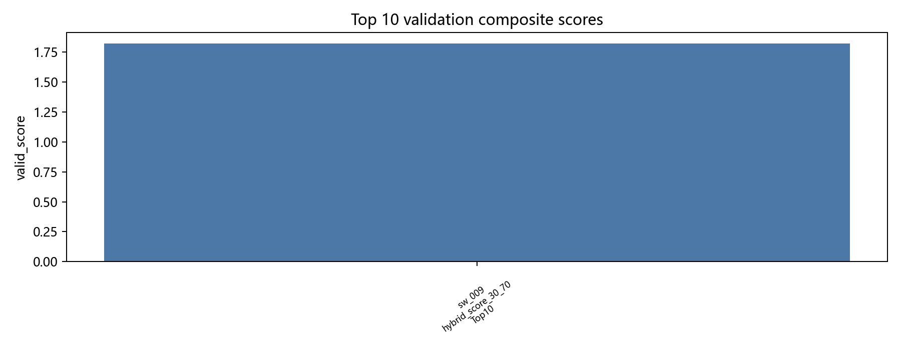

**这张图展示什么：**  
这张图展示参数搜索中验证集综合评分靠前的方案。每个柱子代表一个候选方案的 valid_score。

**应该怎么看：**  
横轴是候选实验方案，纵轴是验证集综合评分。柱子越高，说明该方案在验证集综合评价中越靠前。

**从图中能得到什么结论：**  
模型选择不是单看某一个指标，而是通过综合评分比较不同参数组合。

**需要注意什么：**  
valid_score 只用于验证集选择，不能说明测试集一定同样强。验证集样本季度较少，高分仍可能包含偶然性。

### 图 1-2：前向分步回归参数对比

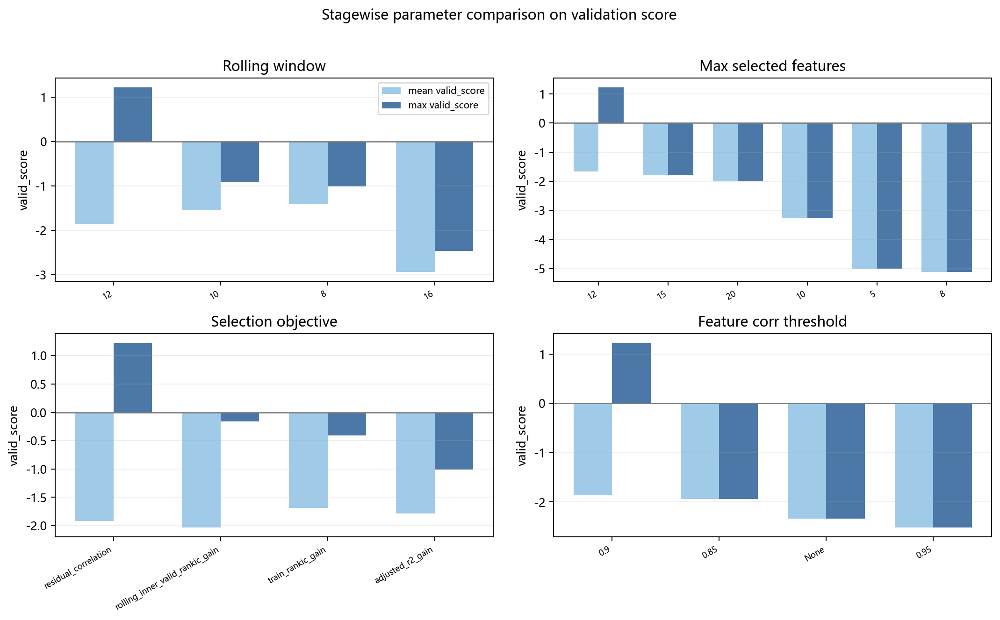

**这张图展示什么：**  
这张图把前向分步回归中的关键参数分组比较，包括滚动窗口长度、最多入选因子数、变量选择目标和相关性过滤阈值。

**应该怎么看：**  
每个小图对应一类参数。浅色柱表示该参数取值下的平均验证集综合评分，深色柱表示该参数取值下出现过的最高验证集综合评分。

**从图中能得到什么结论：**  
这张图可以说明最终配置不是孤立出现的，而是在多个参数取值中比较后得到的。它也能帮助解释哪些参数对验证集表现更敏感。

**需要注意什么：**  
这是分组汇总，不是严格控制变量实验。不同参数之间可能同时变化，因此只能作为参数敏感性参考，不能解释成单个参数的因果影响。

### 图 1-3：预处理参数对比

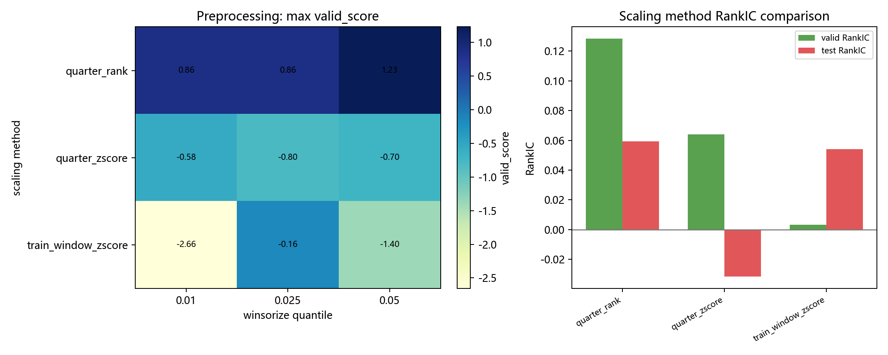

**这张图展示什么：**  
这张图比较不同缩尾比例和标准化方式对验证集综合评分、valid RankIC 和 test RankIC 的影响。

**应该怎么看：**  
左侧热力图展示不同 `winsorize_quantile` 和 `scaling_method` 组合下的最高 valid_score；右侧柱状图比较不同标准化方式下的 valid/test RankIC。

**从图中能得到什么结论：**  
图中可以看出，预处理方式会明显影响排序表现。最终选择 `quarter_rank`，说明横截面排名标准化在本项目验证集中更适合股票排序任务。

**需要注意什么：**  
预处理参数只允许在滚动训练窗口内拟合，不能用全样本信息。图中的 test RankIC 只用于事后展示，不参与参数选择。

### 图 1-4：PROMETHEE 参数组合对比

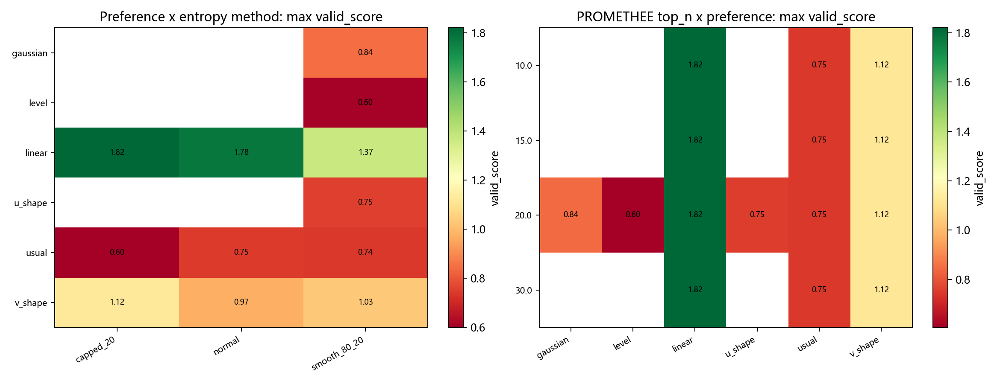

**这张图展示什么：**  
这张图比较 PROMETHEE 相关参数，包括偏好函数、熵权处理方式和 PROMETHEE 指标池大小。

**应该怎么看：**  
颜色越偏向高值，表示该参数组合下出现过更高的验证集综合评分。图中数字是该组参数对应的最高 valid_score。

**从图中能得到什么结论：**  
PROMETHEE 的偏好函数、权重处理方式和指标池大小都会影响候选方案表现，因此报告中需要明确说明最终采用的偏好函数和权重处理方式。

**需要注意什么：**  
本项目最终 Top-K 主方案是 `pure_stagewise_score`，PROMETHEE 参数更多影响 PROMETHEE 评价、Hybrid 候选和解释分析，不能把 PROMETHEE-only 的局部表现夸大为最终策略表现。

### 图 1-5：Hybrid Score 与 Top-K 参数对比

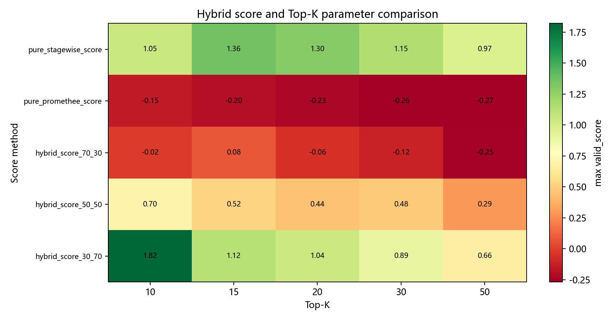

**这张图展示什么：**  
这张图把不同评分方案和不同 Top-K 持仓数量放在一起比较。

**应该怎么看：**  
横轴是 Top-K 数量，纵轴是评分方案，颜色和数字表示该组合下的最高验证集综合评分。

**从图中能得到什么结论：**  
图中可以直观看出，Top10 方案虽然在部分格子中得分很高，但 Top20/Top30 更符合课程项目对分散度和稳健性的要求。最终选择 Top20 不是因为它在所有单项上最高，而是综合考虑了分散度、解释性和验证集表现。

**需要注意什么：**  
该图仍然是验证集比较，不能根据测试集表现反向选择 K。

### 图 1-6：验证集与测试集稳定性参数散点

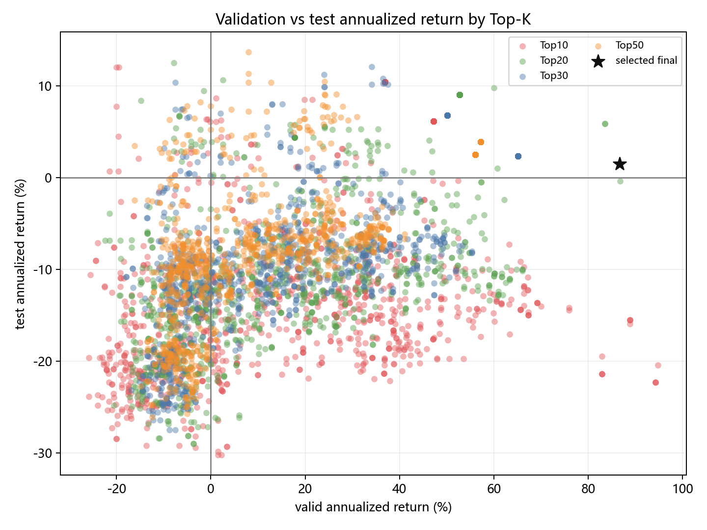

**这张图展示什么：**  
这张图把不同候选方案的 valid 年化收益和 test 年化收益画成散点，并用颜色区分 Top-K 参数。

**应该怎么看：**  
横轴是验证集年化收益，纵轴是测试集年化收益。点越靠右表示验证集收益越高，越靠上表示测试集收益越高。星号表示最终选择方案。

**从图中能得到什么结论：**  
这张图有助于观察“验证集表现好”是否能延续到测试集。最终方案测试集收益为正，但明显弱于验证集，说明样本外稳定性有限。

**需要注意什么：**  
测试集只用于最终检验，不能因为某个点在测试集更高就反向修改最终方案。

### 24.3 前向分步回归结果分析

前向分步回归结果来自 `stagewise_model_summary.csv`、`stagewise_quarterly_rankic.csv` 和 `stagewise_feature_frequency.csv`。

当前优化版 `stagewise_model_summary.csv` 没有保存 R² 字段，因此本文不对优化版 R² 作定量结论。需要注意的是，本项目重点不是收益率点预测精度，而是横截面排序能力、Top-K 组合表现和评级分层效果。

平均 RankIC 如下：

| split | 平均 RankIC |
|---|---:|
| train | -0.0390 |
| valid | 0.1371 |
| test | 0.0649 |

高频入选因子如下：

| 高频入选因子 | 入选次数 | 平均系数 | 正系数比例 | 个股因子 | 宏观因子 |
|---|---:|---:|---:|---|---|
| `composite_净资产收益率_TTM_x_ntis` | 10 | -2.7627 | 0.0000 | 净资产收益率(TTM) | ntis |
| `composite_市净率PB_LF_x_svar` | 9 | 2.9695 | 1.0000 | 市净率PB(LF) | svar |
| `composite_净资产收益率_TTM_x_itgr` | 8 | 0.5968 | 0.6250 | 净资产收益率(TTM) | itgr |
| `composite_流通市值_x_svar` | 7 | 2.4811 | 1.0000 | 流通市值 | svar |
| `composite_总市值_证监会算法_x_bm` | 6 | 0.5924 | 0.5000 | 总市值(证监会算法) | bm |
| `composite_流通市值_x_itgr` | 6 | -0.7742 | 0.3333 | 流通市值 | itgr |

从因子入选频率看，部分综合因子在多个滚动窗口中反复出现，说明它们在不同时间段都对横截面排序有一定贡献。高频因子中既包括盈利能力相关变量，也包括规模、市净率、市场波动和宏观融资环境相关变量。

### 图 2：前向分步回归高频入选因子

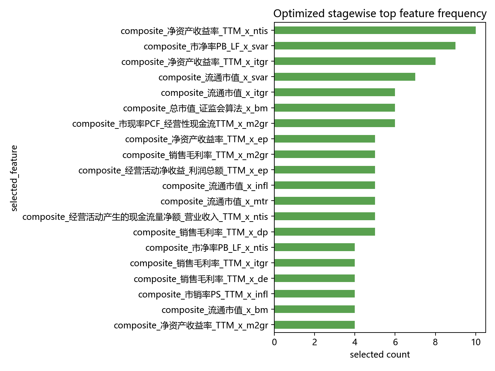

**这张图展示什么：**  
这张图展示滚动窗口前向分步回归中，被反复选中的综合因子。

**应该怎么看：**  
横轴是入选次数，纵轴是因子名称。条形越长，说明该因子在更多季度中被选中。

**从图中能得到什么结论：**  
模型确实从 231 个综合因子中筛出了一批高频变量，而不是每期完全随机选择。

**需要注意什么：**  
高频入选不等于因子永远有效，也不等于该因子可以单独构成稳定盈利策略。

### 图 3：前向分步回归季度 RankIC

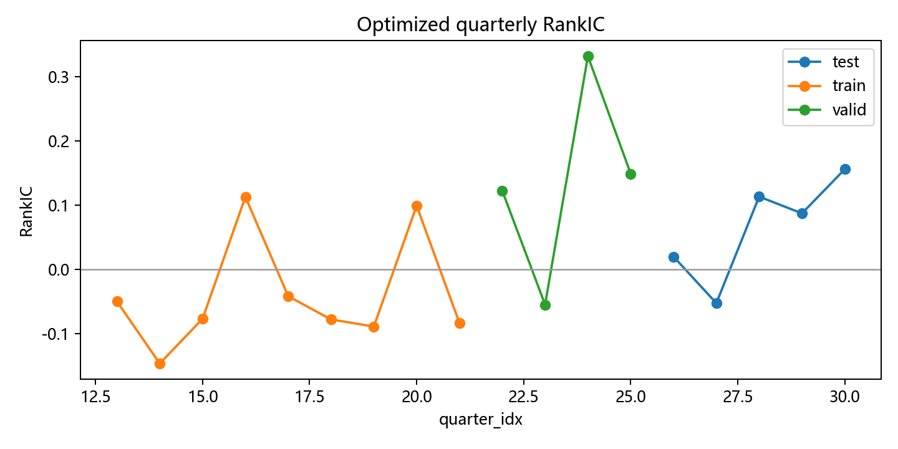

**这张图展示什么：**  
这张图展示每个预测季度的 RankIC，也就是模型排序和真实收益排序之间的一致程度。

**应该怎么看：**  
横轴是季度编号，纵轴是 RankIC。曲线在 0 上方表示该季度有正向排序信号，在 0 下方表示排序较弱或反向。

**从图中能得到什么结论：**  
验证集和测试集平均 RankIC 为正，说明模型存在一定弱排序信号。

**需要注意什么：**  
RankIC 数值不高，不能解释为强预测能力。它只能说明排序有一定参考价值。

### 图 4：个股因子与宏观因子的入选热力图

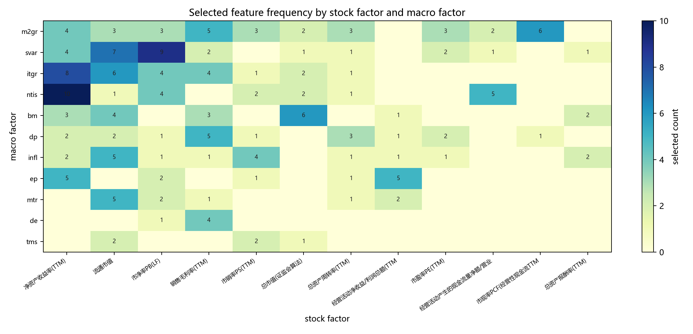

**这张图展示什么：**  
这张图把高频入选综合因子拆成个股因子和宏观因子两个维度。

**应该怎么看：**  
横轴是个股因子，纵轴是宏观因子，颜色越深或数字越大表示该组合入选次数越多。

**从图中能得到什么结论：**  
模型的宏微观综合因子不是形式上的相乘，部分组合确实在滚动变量选择中反复出现。

**需要注意什么：**  
热力图展示的是历史窗口入选结构，不代表未来同样组合一定继续有效。

### 24.4 PROMETHEE 与偏好函数结果分析

PROMETHEE 相关结果来自 `promethee_scores_stagewise.csv`、`entropy_weights_stagewise.csv` 和 `promethee_preference_function_comparison.csv`。

本项目最终 PROMETHEE 偏好函数为 `linear`，参数为 `q = 0.05`、`p = 0.25`。`sigma = 0.20` 只用于 gaussian 对照，不用于最终 linear 函数。

不同偏好函数在验证集上的比较如下：

| 偏好函数 | valid RankIC | valid Top20 年化收益 | valid Sharpe | valid Alpha | 最大回撤 | 评级区分度 | 是否最终选择 |
|---|---:|---:|---:|---:|---:|---:|---|
| usual | -0.1287 | -3.87% | -0.1478 | -22.29% | -19.04% | -8.4238 | False |
| u_shape | -0.1193 | -22.33% | -0.7818 | -39.17% | -21.79% | -7.5250 | False |
| v_shape | -0.1166 | -16.73% | -0.5514 | -31.95% | -21.01% | -7.3078 | False |
| level | -0.1142 | -18.26% | -0.6275 | -34.19% | -20.70% | -7.8009 | False |
| linear | -0.1055 | -17.18% | -0.5921 | -32.13% | -20.08% | -6.7088 | True |
| gaussian | -0.1021 | -14.70% | -0.5593 | -28.99% | -18.65% | -7.0107 | False |

从表中可以看到，PROMETHEE-only 的验证集 RankIC 整体偏弱，说明单独使用 PROMETHEE 并不是本项目最强的选股信号来源。Linear 偏好函数被保留为最终配置，主要因为它适合连续型指标：小差异不直接给满分，中等差异按比例增加，大差异才视为强偏好。

### 图 5：PROMETHEE 偏好函数敏感性比较

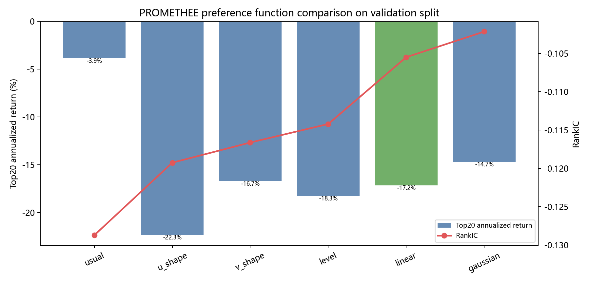

**这张图展示什么：**  
这张图比较不同 PROMETHEE 偏好函数在验证集上的表现，重点展示 Top20 年化收益和 RankIC。

**应该怎么看：**  
横轴是偏好函数，柱子表示 Top20 年化收益，折线表示 RankIC。

**从图中能得到什么结论：**  
不同偏好函数会影响 PROMETHEE 排序结果，偏好函数不是一个可以忽略的技术细节。

**需要注意什么：**  
该图比较的是 PROMETHEE-only 效果，不等于最终 Top20 主策略效果。

### 图 6：PROMETHEE 净流分布

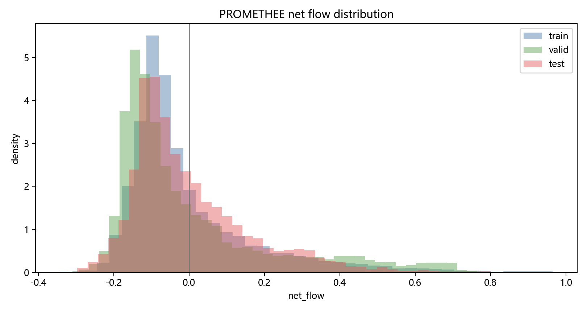

**这张图展示什么：**  
这张图展示 PROMETHEE `net_flow` 在 train、valid、test 中的分布。

**应该怎么看：**  
横轴是净流值，纵轴是密度。分布越分散，说明 PROMETHEE 对股票之间的区分越明显。

**从图中能得到什么结论：**  
净流分布可以帮助判断 PROMETHEE 是否把股票拉开差距，而不是让大量股票挤在一起。

**需要注意什么：**  
net_flow 分布合理不代表收益一定更高，还需要结合 RankIC、Top-K 回测和评级分层一起判断。

### 图 7：PROMETHEE 偏好函数多指标验证集比较

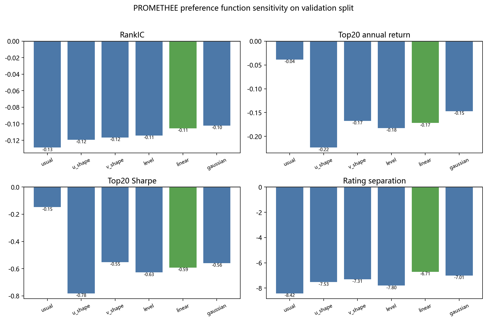

**这张图展示什么：**  
这张图同时比较 RankIC、Top20 年化收益、Sharpe 和评级区分度。

**应该怎么看：**  
每个子图对应一个指标，横轴是偏好函数。绿色柱子标记最终采用的 linear 函数。

**从图中能得到什么结论：**  
偏好函数选择既要看数据表现，也要看解释性和参数可复现性。

**需要注意什么：**  
PROMETHEE-only 指标整体不强，不能把某个偏好函数的局部优势夸大成最终策略优势。

### 24.5 Hybrid Score 结果分析

Hybrid Score 把前向分步回归和 PROMETHEE 的排序分数进行融合。`pure_stagewise_score` 表示只看前向分步回归，`pure_promethee_score` 表示只看 PROMETHEE，`hybrid_score_70_30`、`hybrid_score_50_50`、`hybrid_score_30_70` 表示两者不同权重融合。

固定最终 PROMETHEE 配置和 Top20 后，不同评分方案对比如下：

| 评分方案 | TopK | valid 年化收益 | valid Sharpe | valid Alpha | test 年化收益 | test Sharpe | 说明 |
|---|---:|---:|---:|---:|---:|---:|---|
| `pure_stagewise_score` | 20 | 86.68% | 4.4688 | 53.48% | 1.50% | 0.1068 | 最终主方案 |
| `hybrid_score_30_70` | 20 | 48.59% | 2.5903 | 37.52% | -10.72% | -0.5743 | 候选评分方案 |
| `hybrid_score_50_50` | 20 | 23.06% | 0.8381 | 26.61% | -15.65% | -0.7805 | 候选评分方案 |
| `hybrid_score_70_30` | 20 | 3.12% | 0.1032 | -5.59% | -16.45% | -1.3148 | 候选评分方案 |
| `pure_promethee_score` | 20 | -17.18% | -0.5921 | -32.13% | -23.92% | -2.4121 | 候选评分方案 |

从表中可以看出，本次最终选择的是 `pure_stagewise_score`，说明在验证集主方案选择中，前向分步回归排序比 PROMETHEE-only 或混合分数更适合作为最终 Top20 选股依据。

### 图 7-1：评分方案 valid/test 一眼对比

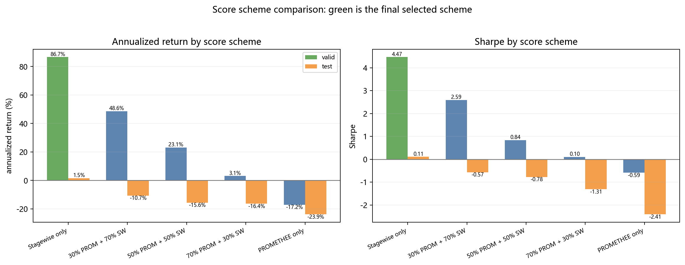

**这张图展示什么：**  
这张图把五种评分方案放在同一张图里，直接比较 valid/test 年化收益和 Sharpe。

**应该怎么看：**  
左图看年化收益，右图看 Sharpe。每个评分方案都有两根柱子：valid 和 test。绿色代表最终选中的 `Stagewise only`。

**从图中能得到什么结论：**  
这张图最直观地说明，`pure_stagewise_score` 在验证集表现最强，测试集虽然明显变弱，但仍然比 PROMETHEE-only 和多数 Hybrid 方案更稳。

**需要注意什么：**  
valid 与 test 差距很大，说明样本外稳定性有限，不能把验证集表现直接当作未来收益。

### 图 7-2：评分方案成绩单

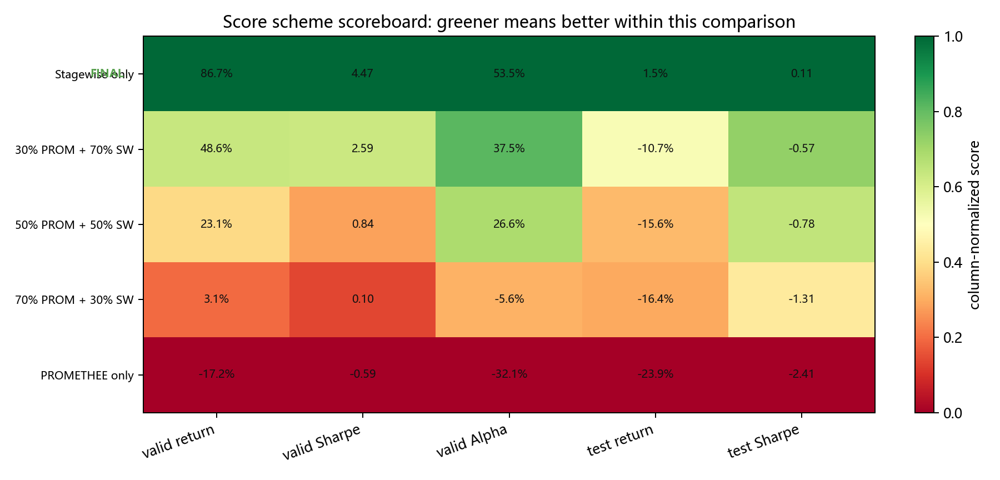

**这张图展示什么：**  
这张图像“成绩单”一样，把每个评分方案在 valid return、valid Sharpe、valid Alpha、test return、test Sharpe 上的表现放在一起。

**应该怎么看：**  
颜色越绿表示在该列指标中相对越好，颜色越红表示相对越弱。格子里的数字就是对应指标值。

**从图中能得到什么结论：**  
不用看复杂表格也能看出，`Stagewise only` 在主要指标上整体更靠前，PROMETHEE-only 在本项目中明显较弱。

**需要注意什么：**  
颜色是列内相对比较，不代表绝对好坏。比如某个指标相对最绿，也仍可能只是“比其他方案好”，不等于非常强。

### 图 7-3：不同评分方案 Top20 累计收益曲线

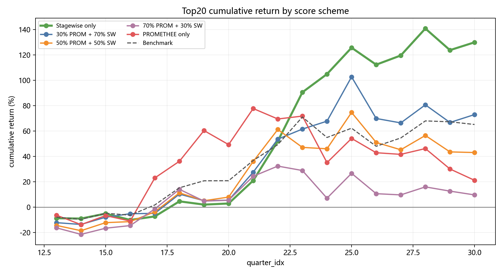

**这张图展示什么：**  
这张图把五种评分方案都按 Top20 选股，比较它们随时间累积的收益曲线。

**应该怎么看：**  
每条线代表一种评分方案，虚线是等权基准。最终方案 `Stagewise only` 用更粗的绿色线表示。

**从图中能得到什么结论：**  
如果一条线长期高于其他线，说明该评分方案在样本期内更有优势。图中最终方案整体更容易被肉眼识别出来。

**需要注意什么：**  
累计收益受少数季度影响较大，因此还要结合 Sharpe、回撤、RankIC 和测试集表现一起看。

### 图 7-4：评分方案 valid/test 象限图

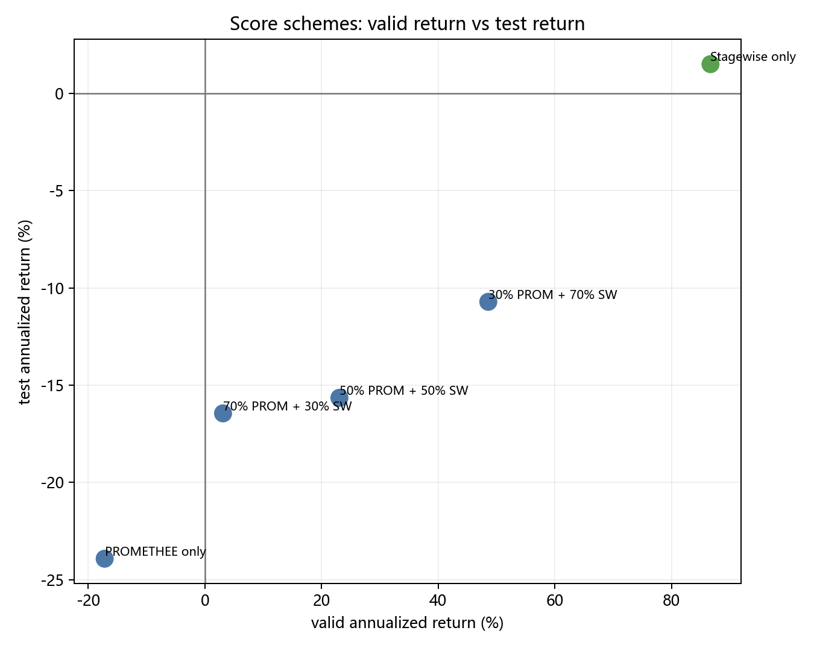

**这张图展示什么：**  
这张图把每个评分方案画成一个点，横轴是 valid 年化收益，纵轴是 test 年化收益。

**应该怎么看：**  
越靠右表示验证集收益越高，越靠上表示测试集收益越高。右上角最好，左下角最差。

**从图中能得到什么结论：**  
这张图非常直观地显示：有些方案验证集不差，但测试集表现明显变弱；最终方案处在相对更可接受的位置。

**需要注意什么：**  
不能因为某个方案测试集位置更高就反向选择它。最终方案仍必须根据训练集和验证集确定。

### 24.6 Top-K 回测结果分析

Top-K 回测的意思是：每个季度按评分从高到低排序，选出前 K 只股票等权持有到下一期。本项目比较了 Top10、Top15、Top20、Top30、Top50，其中最终主方案为 Top20。

最终 Top20 主方案绩效如下：

| 策略 | K | split | 年化收益 | 年化波动 | Sharpe | Alpha | Beta | 最大回撤 | 胜率 | 换手率 |
|---|---:|---|---:|---:|---:|---:|---:|---:|---:|---:|
| `pure_stagewise_score_top20` | 20 | all | 20.33% | 20.53% | 0.9904 | 8.34% | 1.0068 | -7.08% | 66.67% | 0.8250 |
| `pure_stagewise_score_top20` | 20 | test | 1.50% | 14.03% | 0.1068 | 0.43% | 0.8633 | -7.08% | 60.00% | 0.8100 |
| `pure_stagewise_score_top20` | 20 | train | 8.82% | 16.75% | 0.5264 | -6.00% | 1.0438 | -5.28% | 55.56% | 0.7833 |
| `pure_stagewise_score_top20` | 20 | valid | 86.68% | 19.40% | 4.4688 | 53.48% | 0.8029 | 0.00% | 100.00% | 0.9375 |

同一评分下，不同 K 的验证集和测试集表现如下：

| K | valid 年化收益 | valid Sharpe | valid Alpha | test 年化收益 | test Sharpe | test 最大回撤 | 是否最终 |
|---:|---:|---:|---:|---:|---:|---:|---|
| 10 | 47.21% | 4.4074 | 41.25% | 6.14% | 0.5805 | -6.10% | False |
| 15 | 96.31% | 4.0533 | 59.04% | 2.32% | 0.1941 | -7.99% | False |
| 20 | 86.68% | 4.4688 | 53.48% | 1.50% | 0.1068 | -7.08% | True |
| 30 | 65.12% | 5.1297 | 43.44% | 2.36% | 0.1651 | -5.09% | False |
| 50 | 56.10% | 4.2849 | 35.93% | 2.49% | 0.1712 | -3.08% | False |

Top10 的集中度更高，可能在某些阶段收益更好，但单只股票权重也更大；Top50 更分散，但可能稀释信号。Top20 在信号强度和持仓分散之间更平衡，因此更适合作为课程项目主方案。

### 图 8：Top-K 累计收益曲线

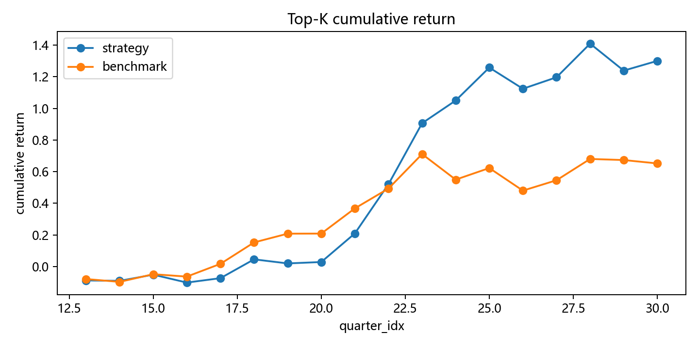

**这张图展示什么：**  
这张图展示最终 Top20 组合随季度累积的收益表现。

**应该怎么看：**  
横轴是季度，纵轴是累计收益。曲线越向上，说明组合累计表现越好。

**从图中能得到什么结论：**  
它可以观察组合是否在较长区间内跑出相对优势，而不是只看某一个季度。

**需要注意什么：**  
累计收益会受到少数大涨或大跌季度影响，不能单独作为最终判断依据。

### 图 9：Top20 每季度收益与基准对比

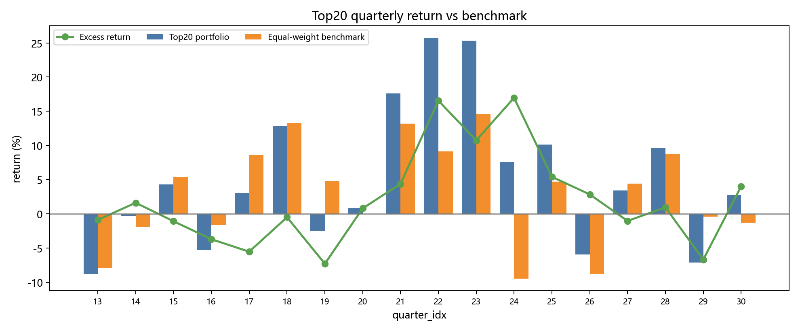

**这张图展示什么：**  
这张图把每个季度的 Top20 组合收益、等权基准收益和超额收益放在一起。

**应该怎么看：**  
横轴是季度，柱子表示组合和基准收益，折线表示超额收益。超额收益大于 0 表示当季跑赢基准。

**从图中能得到什么结论：**  
它能说明策略收益来自哪些季度，也能看出组合表现不是每期都稳定领先。

**需要注意什么：**  
季度样本数有限，不能因为某几个季度表现好就宣称策略稳定盈利。

### 图 10：Top20 净值与回撤

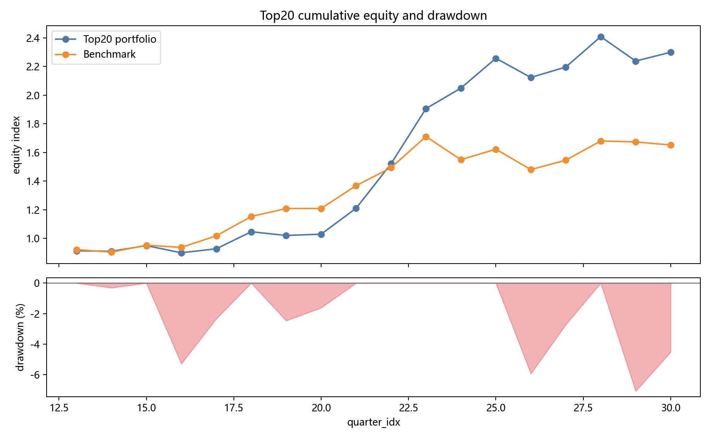

**这张图展示什么：**  
这张图上半部分展示组合和基准的累计净值，下半部分展示组合回撤。

**应该怎么看：**  
净值曲线越高表示累计收益越高；回撤越深表示从高点跌下来的幅度越大。

**从图中能得到什么结论：**  
该图可以同时观察收益和风险，比只看收益率更完整。

**需要注意什么：**  
最大回撤在样本期内可控，不代表未来回撤一定同样可控。

### 图 11：Top-K 风险收益散点图

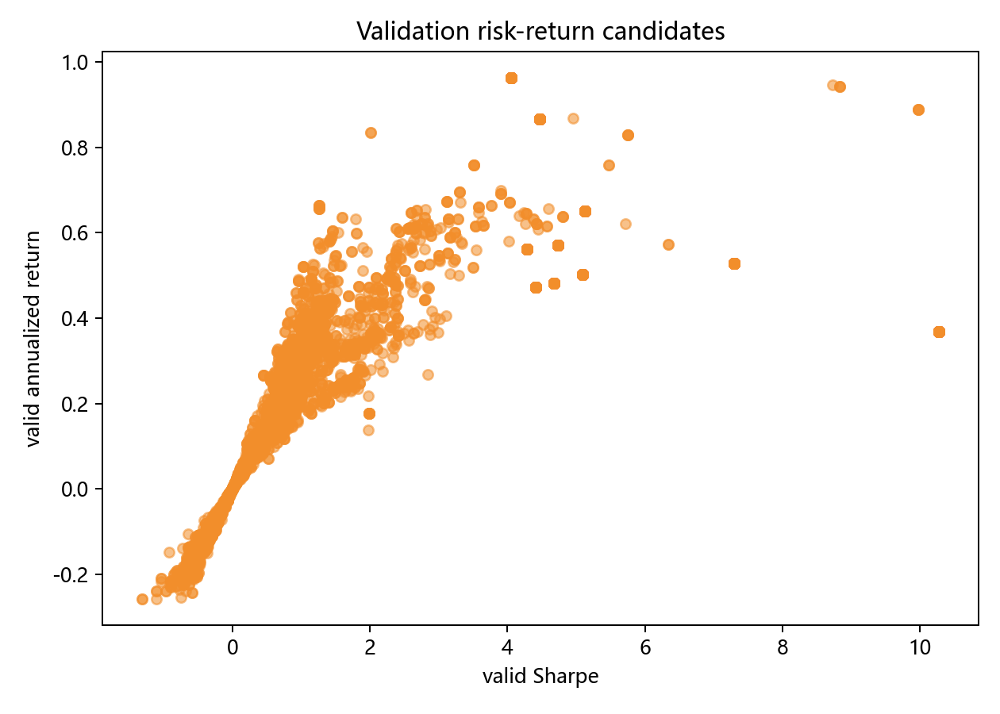

**这张图展示什么：**  
这张图用于比较候选方案的风险和收益关系。

**应该怎么看：**  
横轴通常表示年化波动率或风险，纵轴表示年化收益。越靠左上方，一般表示收益更高、风险更低。

**从图中能得到什么结论：**  
它帮助说明最终方案不是单纯追求最高收益，而是要兼顾风险。

**需要注意什么：**  
散点图展示的是历史样本结果，不能保证未来风险收益位置不变。

### 图 12：Top-K 季度收益图

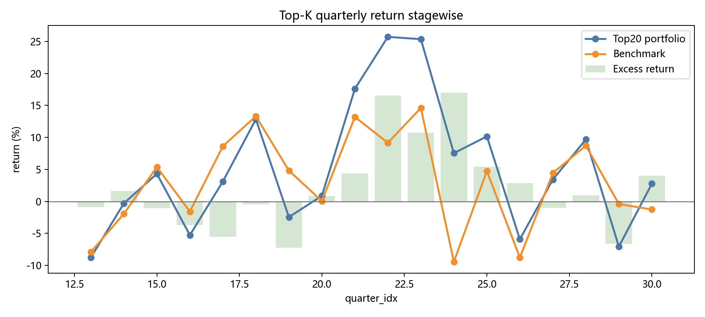

**这张图展示什么：**  
这张图展示 Top20 组合每个季度的收益、基准收益和超额收益。

**应该怎么看：**  
横轴是季度，纵轴是收益率。组合线和基准线的距离可以理解为当期相对表现。

**从图中能得到什么结论：**  
它能帮助识别模型在哪些季度表现较好，哪些季度表现较弱。

**需要注意什么：**  
季度收益波动较大是股票策略常见现象，不能只看某一个季度判断模型好坏。

### 图 13：Top20 换手率与持仓数量

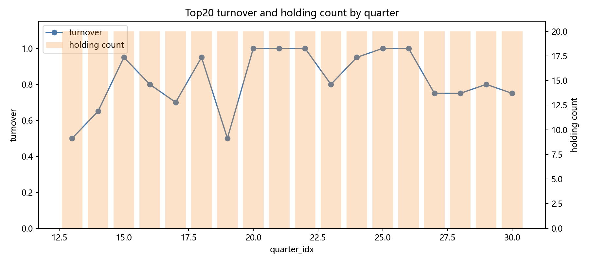

**这张图展示什么：**  
这张图展示每个季度 Top20 组合的换手率和持仓数量。

**应该怎么看：**  
折线表示换手率，柱子表示持仓数量。换手率越高，说明相邻季度持仓变化越大。

**从图中能得到什么结论：**  
最终组合持仓数量稳定为 20，但换手率仍较高，说明模型会根据季度信息动态调整股票。

**需要注意什么：**  
高换手率可能带来交易成本。当前回测未细化交易成本，因此真实投资表现可能弱于无成本回测。

### 24.7 13 级评级结果分析

评级结果来自 `rating_performance_stagewise.csv`。每个季度内，股票按最终评分从高到低排序，并分成 13 个等级：AAA、AA+、AA、AA-、A+、A、A-、BBB+、BBB、BBB-、BB+、BB、B。

高评级组和低评级组对比如下：

| split | 高评级组平均收益 | 低评级组平均收益 | 高低评级差 |
|---|---:|---:|---:|
| test | 1.5139 | -0.1536 | 1.6675 |
| train | 3.1451 | 4.3140 | -1.1689 |
| valid | 8.3833 | 2.8870 | 5.4962 |

评级收益不完全单调并不必然说明模型无效，因为股票未来收益存在较强随机性。评级体系的主要作用是把股票池按照综合投资前景分层，用于候选池筛选和风险分析，而不是保证 AAA 一定比 AA、A 或 BBB 收益更高。

### 图 14：13 级评级平均收益

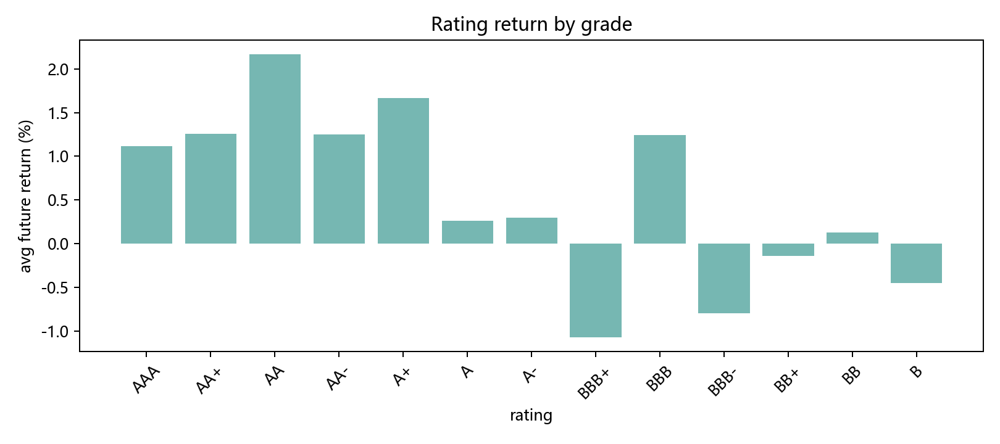

**这张图展示什么：**  
这张图展示不同评级组的平均未来收益。AAA 是最高评分组，B 是最低评分组。

**应该怎么看：**  
横轴是评级等级，纵轴是平均 `future_return_1q`。柱子越高，表示该评级组事后平均收益越高。

**从图中能得到什么结论：**  
高评级组整体具有一定筛选价值，尤其高评级组相对低评级组有一定优势。

**需要注意什么：**  
评级不要求严格单调。某些中间评级收益高于更高评级，并不必然说明模型失败。

### 图 15：高/中/低评级组收益分离

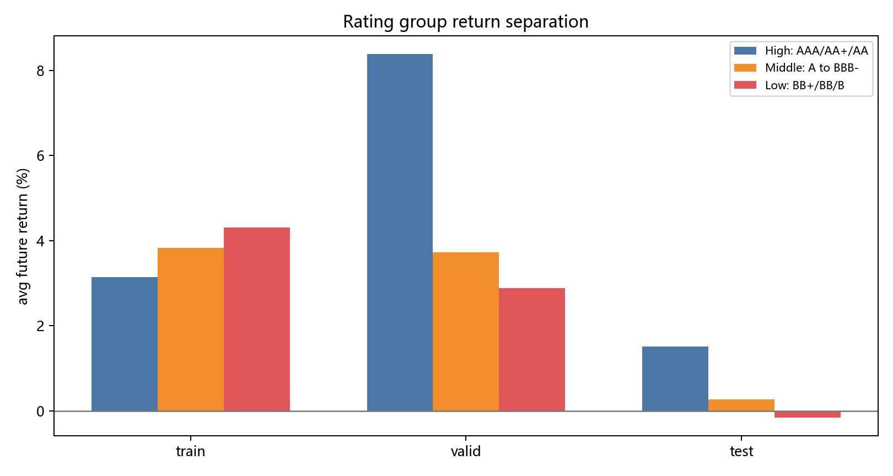

**这张图展示什么：**  
这张图把 13 级评级合并成高、中、低三个组，展示各 split 的平均收益差异。

**应该怎么看：**  
横轴是 train、valid、test，柱子颜色代表高评级组、中评级组和低评级组。

**从图中能得到什么结论：**  
valid 和 test 中，高评级组整体优于低评级组，说明评级具有一定候选池筛选价值。

**需要注意什么：**  
训练集、验证集、测试集表现不完全一致，说明评级分层仍存在样本期不稳定性。

### 图 16：评分十分位收益

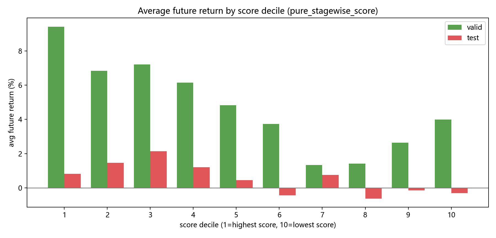

**这张图展示什么：**  
这张图把股票按最终评分分成 10 组，观察高分组和低分组的平均未来收益。

**应该怎么看：**  
横轴是评分十分位，1 表示最高分组，10 表示最低分组；纵轴是平均未来收益。

**从图中能得到什么结论：**  
如果高分组整体高于低分组，说明评分有一定横截面筛选价值。

**需要注意什么：**  
十分位结果同样不要求严格单调；股票收益噪声较大，中间组可能出现波动。

### 24.8 训练集、验证集、测试集对比

train 是学习阶段，valid 是参数选择阶段，test 是最终考试。最终方案不能由 test 反向决定。

| split | RankIC | 年化收益 | Sharpe | Alpha | 最大回撤 | 说明 |
|---|---:|---:|---:|---:|---:|---|
| test | 0.0649 | 1.50% | 0.1068 | 0.43% | -7.08% | 最终考试，只作 holdout 检验 |
| train | -0.0390 | 8.82% | 0.5264 | -6.00% | -5.28% | 学习阶段，用于形成模型规律 |
| valid | 0.1371 | 86.68% | 4.4688 | 53.48% | 0.00% | 参数选择阶段，最终方案主要依据 |

### 图 17：验证集与测试集核心指标对比

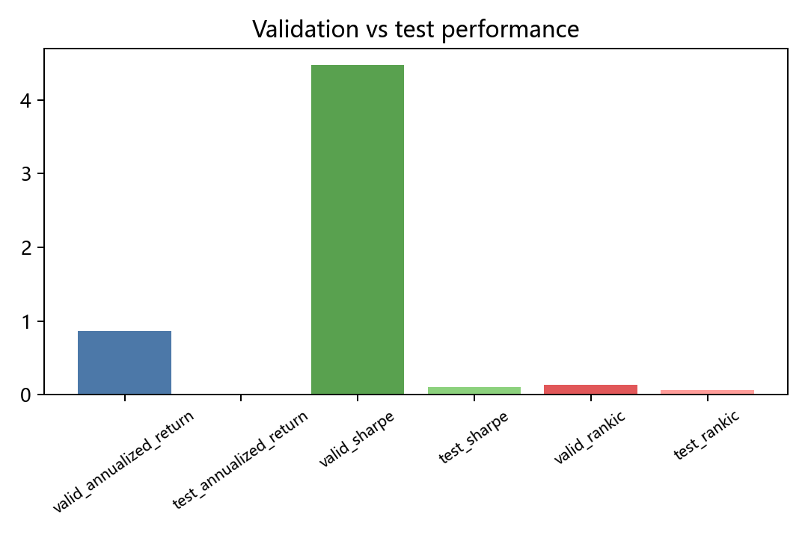

**这张图展示什么：**  
这张图展示最终方案在验证集和测试集上的核心指标对比。

**应该怎么看：**  
横轴是指标名称，纵轴是指标值。valid 和 test 指标放在一起，有助于观察样本外稳定性。

**从图中能得到什么结论：**  
验证集表现明显较强，测试集虽然弱很多，但没有出现严重崩溃，年化收益和 Sharpe 仍为正。

**需要注意什么：**  
valid 强、test 弱说明样本外稳定性有限，不能把验证集高收益直接外推到未来。

### 图 18：RankIC 分区汇总

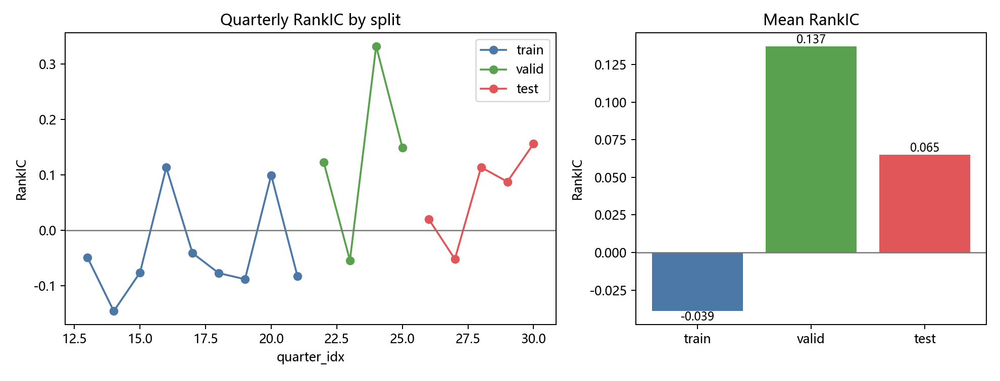

**这张图展示什么：**  
这张图把季度 RankIC 曲线和 train、valid、test 平均 RankIC 放在一起。

**应该怎么看：**  
左侧看每个季度的 RankIC 波动，右侧看不同 split 的平均 RankIC。

**从图中能得到什么结论：**  
valid 和 test 平均 RankIC 为正，说明模型有一定排序信号；但 train 平均 RankIC 为负，也说明模型不是训练集强拟合。

**需要注意什么：**  
RankIC 是排序相关，不是收益率预测精度；弱正 RankIC 只能说明有一定排序参考价值。

### 24.9 总体结果结论

整体来看，模型完成了从 231 个综合因子动态筛选、PROMETHEE 综合评价、Hybrid Score 融合到 Top-K 回测和 13 级评级的完整流程。验证集上，最终 Top20 主方案取得较好的排序和组合表现；测试集上，收益和 Sharpe 明显弱于验证集，但没有出现严重崩溃。

因此，更稳妥的结论是：该框架具有一定横截面排序和投资前景评价价值，适合作为课程作业中的可解释建模框架。但由于股票收益噪声较大、测试期季度数量有限、换手率较高，不能把它宣称为稳定盈利策略，也不能说模型能够准确预测未来收益率。

### 24.10 可视化图像总览：应该先看哪几张图

为了让结果更容易判断，本文把图像分成四类来看，而不是把所有图混在一起。读报告时可以按下面顺序阅读：

| 阅读顺序 | 图像类型 | 对应图像 | 主要回答的问题 |
|---:|---|---|---|
| 1 | 参数选择图 | 图 1、图 1-2 到图 1-6 | 为什么最后选择这组 rolling window、前向选择规则、PROMETHEE 参数、Hybrid 权重和 Top-K |
| 2 | 评分方案对比图 | 图 7-1 到图 7-4 | pure stagewise、pure PROMETHEE 和不同 Hybrid Score 到底谁更强 |
| 3 | 投资组合表现图 | 图 8 到图 13 | Top-K 组合的累计收益、季度收益、风险收益位置、回撤和换手率如何 |
| 4 | 评级与稳定性图 | 图 14 到图 18 | 13 级评级有没有分层价值，valid 和 test 是否一致，RankIC 是否为正 |

最直观的评分方案对比应优先看图 7-1、图 7-2、图 7-3 和图 7-4。图 7-1 用柱状图直接比较 valid/test 年化收益和 Sharpe；图 7-2 像成绩单一样把核心指标放在同一张热力图里；图 7-3 看不同评分方案的 Top20 累计收益曲线；图 7-4 看验证集好、测试集是否也能保持正收益。

从这些图可以得到一个清楚结论：最终方案不是因为某一个测试集指标最高才被选中，而是因为它在验证集综合评分、Top20 表现、评分解释性和测试集不崩溃之间比较平衡。相比之下，某些 Hybrid 或 pure PROMETHEE 方案在验证集或测试集上更容易出现收益弱、Sharpe 弱或稳定性不足的问题。

但这些图也不能被过度解释。图像展示的是历史样本内和 holdout 测试期的表现，不是未来收益保证。尤其是测试集季度数量有限，valid 和 test 表现差距明显，因此更合适的说法是“模型具备一定排序和筛选价值”，而不是“模型可以稳定赚钱”。

## 25. 本项目最终一句话总结

本文在数据审计基础上，将作业理论中的 276 个综合因子修正为实际可复现的 231 个宏微观综合因子，并以移动窗口前向分步回归作为变量选择主线，结合熵权-PROMETHEE 多属性评价方法构建投资前景分数，进一步通过 Hybrid Score、13 级评级和 Top-K 回测检验模型效果。该框架的优势在于流程完整、变量选择动态化、评分结果可解释；其局限在于股票收益噪声较大，测试期表现可能存在不稳定性，因此更适合作为课程作业中的投资前景评价框架，而不是直接宣称为稳定盈利策略。


<!-- ROBUST_V3_SECTION_START -->

## 25. 当前模型的问题：为什么需要稳健优化

上一版模型已经完成 231 个宏微观综合因子、移动窗口前向分步回归、熵权-PROMETHEE、Hybrid Score、13 级评级和 Top-K 回测，但结果也暴露出几个问题。第一，测试集 RankIC 为正，说明模型确实有一定横截面排序能力；第二，测试集年化收益、Alpha 和 Sharpe 较弱，说明排序信号转化为真实组合收益的能力有限；第三，验证集明显好于测试集，说明参数对验证区间较敏感；第四，Top20 换手率偏高，如果考虑交易成本，真实收益可能进一步被压缩。

因此，本轮 v3 不是推翻原模型，而是在原主线下做稳健优化：降低模型复杂度，减少换手，关注 Alpha 稳定性和 valid/test 差距，而不是继续追求验证集收益最大化。

## 26. 稳健优化思路

稳健优化主要做了八件事：

1. 将 `max_selected_features` 降到 5、6、8、10，减少噪声因子进入模型；
2. 提高 `min_improvement`，要求新因子必须带来更明显边际改善；
3. 比较 OLS 和 Ridge，降低小样本窗口下的系数波动；
4. 统计稳定因子池，测试期优先使用更稳定的因子；
5. 比较 Top20、Top30、Top50，不再强制 Top20；
6. 加入 buffer rule，降低持仓频繁进出；
7. 加入 rank smoothing，只用过去评分平滑当前评分；
8. 使用 `robust_valid_score`，提高 RankIC、ICIR、Alpha、Information Ratio 的权重，同时惩罚换手率和回撤。

整个过程仍然只用 train 和 valid 做参数选择，test 只用于最终 holdout 检验。

## 27. 稳健优化后的最终参数

最终稳健模型参数如下：

| 参数 | 稳健模型取值 |
|---|---|
| `experiment_id` | `rb_003` |
| `rolling_window` | `12` |
| `max_selected_features` | `5` |
| `selection_objective` | `residual_correlation` |
| `refit_method` | `Ridge` |
| `ridge_alpha` | `3.0` |
| `min_improvement` | `0.001` |
| `feature_corr_threshold` | `0.9` |
| `promethee_top_n` | `20` |
| `entropy_weight_method` | `smooth_80_20` |
| `preference_function` | `linear` |
| `hybrid_score_name` | `pure_stagewise_score` |
| `top_k` | `20` |
| `rank_smoothing` | `none` |
| `buffer_rule` | `buffer` |
| `stable_core_feature_count` | `11` |


## 28. 原模型 vs 稳健模型结果对比

原模型和稳健模型的核心指标对比如下：

| 指标 | 原模型 | 稳健模型 | 是否改善 |
|---|---:|---:|---|
| test RankIC | 0.0649 | 0.0323 | 否 |
| test 年化收益 | 1.50% | -2.34% | 否 |
| test Alpha | 0.43% | -3.73% | 否 |
| test Sharpe | 0.1068 | -0.1160 | 否 |
| test Information Ratio | NA | -0.1549 | NA |
| test 最大回撤 | -7.08% | -3.77% | 是 |
| test 换手率 | 81.00% | 51.00% | 是 |
| excess win rate | NA | 60.00% | NA |
| valid/test Sharpe gap | 4.3620 | 4.9306 | 否 |
| valid/test return gap | 85.18% | 99.74% | 否 |


这张表的重点不是单看收益，而是看测试集 RankIC、Alpha、Information Ratio、最大回撤、换手率，以及 valid/test 差距是否改善。如果稳健模型牺牲了部分验证集收益，但降低换手或缩小 valid/test 差距，这仍然是有意义的稳健化结果。

### 图 25：原模型与稳健模型 valid/test 对比

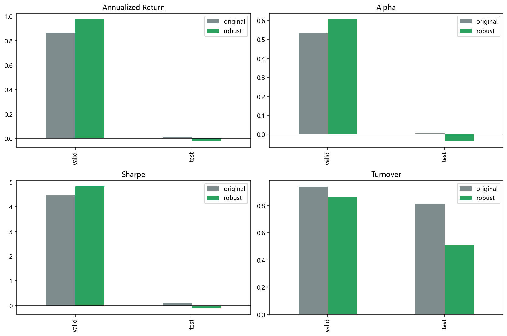

**这张图展示什么：**  
这张图用于展示稳健优化相关结果，帮助比较原模型、稳健模型或不同参数方案的差异。

**应该怎么看：**  
重点看横轴和图例中的模型、split 或参数组合，再看纵轴指标是收益、Alpha、Information Ratio、换手率还是回撤。收益和 Alpha 通常越高越好，换手率和回撤通常越低越稳。

**从图中能得到什么结论：**  
如果稳健模型在测试集 Alpha、Information Ratio、回撤或换手率上更好，说明稳健化提高了可交易性或样本外稳定性；如果收益没有提高，也要如实说明收益转化仍有限。

**需要注意什么：**  
这些图不能证明模型未来一定稳定盈利。测试期季度数量有限，所有 test 指标只能作为 holdout 检验，不能反向用于调参。


## 29. 排序信号向投资收益的转化分析

RankIC 为正只能说明模型排序方向有一定参考价值，不自动等于组合收益高。排序信号要转化为投资收益，还会受到持仓数量、换手率、噪声股票、极端收益和基准波动影响。

本轮新增 `signal_to_portfolio_conversion.csv`，专门记录 RankIC、年化收益、Alpha、Sharpe、Information Ratio、最大回撤、换手率和超额收益胜率。它的作用是回答：模型排序信号到底有没有转化成更好的组合表现。

### 图 26：RankIC 与组合收益转化

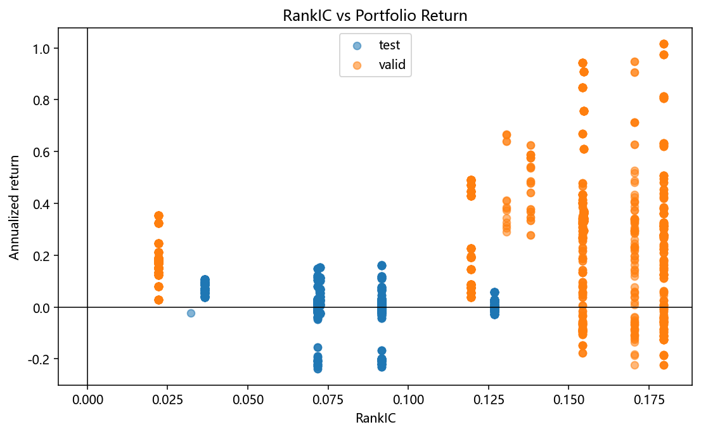

**这张图展示什么：**  
这张图用于展示稳健优化相关结果，帮助比较原模型、稳健模型或不同参数方案的差异。

**应该怎么看：**  
重点看横轴和图例中的模型、split 或参数组合，再看纵轴指标是收益、Alpha、Information Ratio、换手率还是回撤。收益和 Alpha 通常越高越好，换手率和回撤通常越低越稳。

**从图中能得到什么结论：**  
如果稳健模型在测试集 Alpha、Information Ratio、回撤或换手率上更好，说明稳健化提高了可交易性或样本外稳定性；如果收益没有提高，也要如实说明收益转化仍有限。

**需要注意什么：**  
这些图不能证明模型未来一定稳定盈利。测试期季度数量有限，所有 test 指标只能作为 holdout 检验，不能反向用于调参。


### 图 27：信号转化能力对比

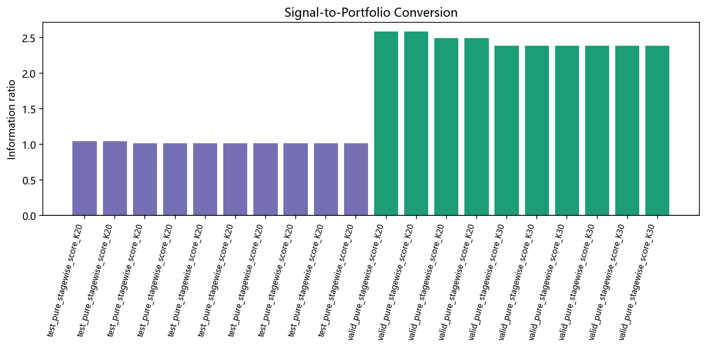

**这张图展示什么：**  
这张图用于展示稳健优化相关结果，帮助比较原模型、稳健模型或不同参数方案的差异。

**应该怎么看：**  
重点看横轴和图例中的模型、split 或参数组合，再看纵轴指标是收益、Alpha、Information Ratio、换手率还是回撤。收益和 Alpha 通常越高越好，换手率和回撤通常越低越稳。

**从图中能得到什么结论：**  
如果稳健模型在测试集 Alpha、Information Ratio、回撤或换手率上更好，说明稳健化提高了可交易性或样本外稳定性；如果收益没有提高，也要如实说明收益转化仍有限。

**需要注意什么：**  
这些图不能证明模型未来一定稳定盈利。测试期季度数量有限，所有 test 指标只能作为 holdout 检验，不能反向用于调参。


### 图 28：换手率与 Alpha 的关系

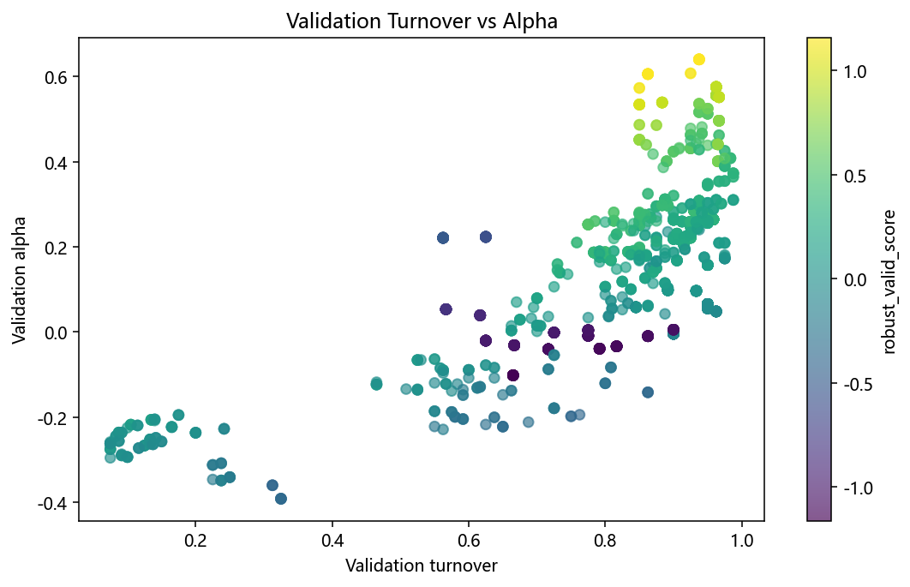

**这张图展示什么：**  
这张图用于展示稳健优化相关结果，帮助比较原模型、稳健模型或不同参数方案的差异。

**应该怎么看：**  
重点看横轴和图例中的模型、split 或参数组合，再看纵轴指标是收益、Alpha、Information Ratio、换手率还是回撤。收益和 Alpha 通常越高越好，换手率和回撤通常越低越稳。

**从图中能得到什么结论：**  
如果稳健模型在测试集 Alpha、Information Ratio、回撤或换手率上更好，说明稳健化提高了可交易性或样本外稳定性；如果收益没有提高，也要如实说明收益转化仍有限。

**需要注意什么：**  
这些图不能证明模型未来一定稳定盈利。测试期季度数量有限，所有 test 指标只能作为 holdout 检验，不能反向用于调参。


## 30. 换手率与交易可实现性

原模型 Top20 换手率偏高，说明每个季度持仓变化较大。即使回测没有计入交易成本，真实交易也会受到佣金、冲击成本和买卖价差影响。

v3 加入 buffer rule：Top30 下，新买入需要进入 Top25，原持仓只要仍在 Top40 内就保留；Top20 下，新买入需要进入 Top15，原持仓仍在 Top30 内就保留。这个规则的目标是减少因为排名小幅波动造成的频繁交易。

### 图 29：原模型与稳健模型换手率对比

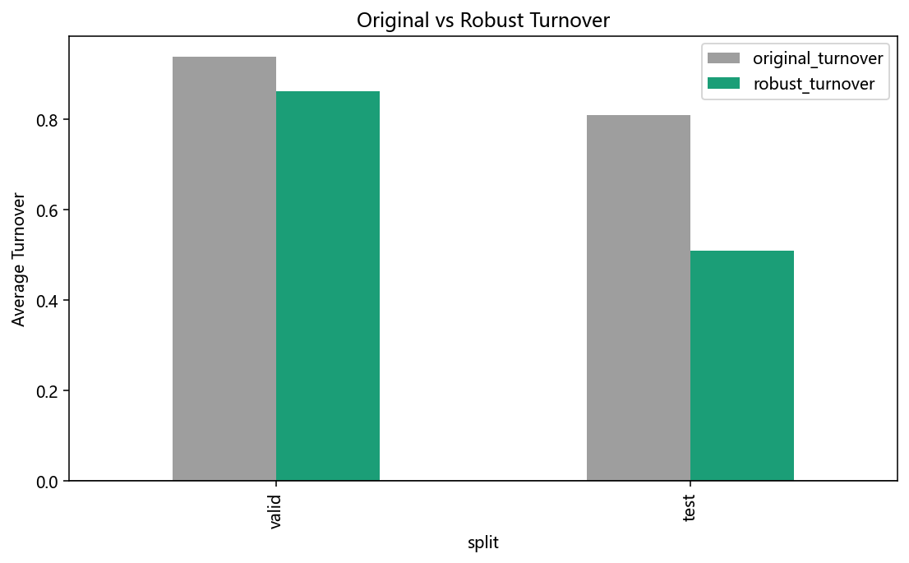

**这张图展示什么：**  
这张图用于展示稳健优化相关结果，帮助比较原模型、稳健模型或不同参数方案的差异。

**应该怎么看：**  
重点看横轴和图例中的模型、split 或参数组合，再看纵轴指标是收益、Alpha、Information Ratio、换手率还是回撤。收益和 Alpha 通常越高越好，换手率和回撤通常越低越稳。

**从图中能得到什么结论：**  
如果稳健模型在测试集 Alpha、Information Ratio、回撤或换手率上更好，说明稳健化提高了可交易性或样本外稳定性；如果收益没有提高，也要如实说明收益转化仍有限。

**需要注意什么：**  
这些图不能证明模型未来一定稳定盈利。测试期季度数量有限，所有 test 指标只能作为 holdout 检验，不能反向用于调参。


## 31. Alpha 稳定性分析

本轮新增 Alpha 稳定性指标，包括季度超额收益、超额收益胜率、平均季度 Alpha、Alpha t 值、Information Ratio、tracking error 和 alpha stability score。

当前稳健模型测试集核心指标为：

| 指标 | test 取值 |
|---|---:|
| 年化收益 | -2.34% |
| Alpha | -3.73% |
| Sharpe | -0.1160 |
| Information Ratio | -0.1549 |
| 最大回撤 | -3.77% |
| 换手率 | 51.00% |
| 超额收益胜率 | 60.00% |

### 图 30：Alpha 原模型与稳健模型对比

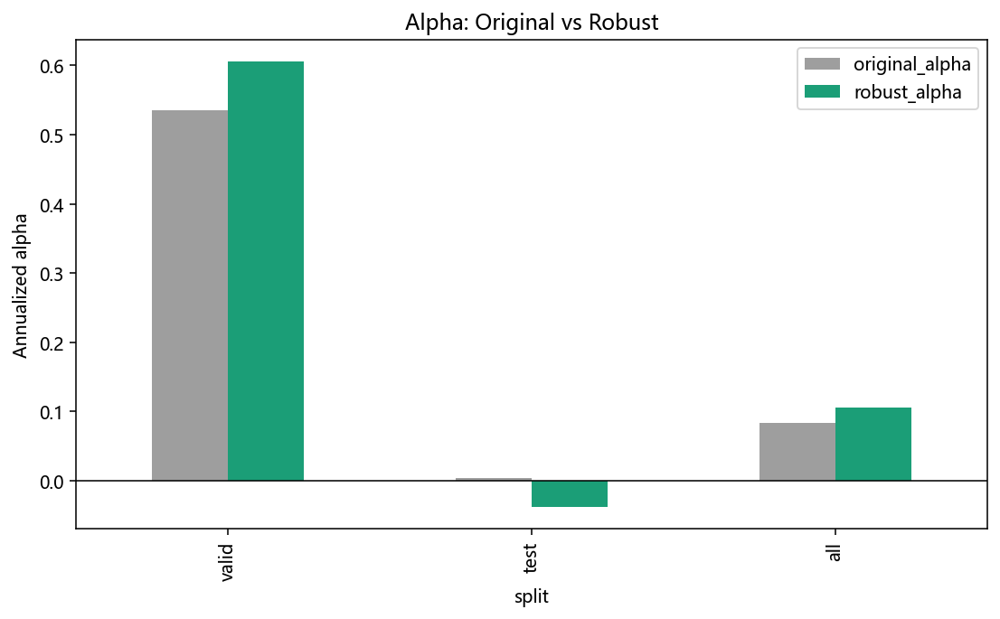

**这张图展示什么：**  
这张图用于展示稳健优化相关结果，帮助比较原模型、稳健模型或不同参数方案的差异。

**应该怎么看：**  
重点看横轴和图例中的模型、split 或参数组合，再看纵轴指标是收益、Alpha、Information Ratio、换手率还是回撤。收益和 Alpha 通常越高越好，换手率和回撤通常越低越稳。

**从图中能得到什么结论：**  
如果稳健模型在测试集 Alpha、Information Ratio、回撤或换手率上更好，说明稳健化提高了可交易性或样本外稳定性；如果收益没有提高，也要如实说明收益转化仍有限。

**需要注意什么：**  
这些图不能证明模型未来一定稳定盈利。测试期季度数量有限，所有 test 指标只能作为 holdout 检验，不能反向用于调参。


### 图 31：季度超额收益

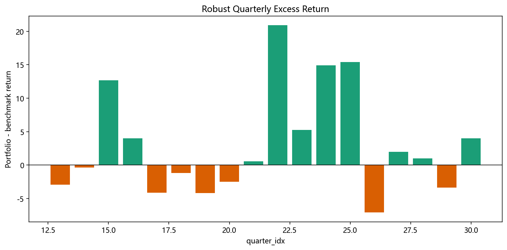

**这张图展示什么：**  
这张图用于展示稳健优化相关结果，帮助比较原模型、稳健模型或不同参数方案的差异。

**应该怎么看：**  
重点看横轴和图例中的模型、split 或参数组合，再看纵轴指标是收益、Alpha、Information Ratio、换手率还是回撤。收益和 Alpha 通常越高越好，换手率和回撤通常越低越稳。

**从图中能得到什么结论：**  
如果稳健模型在测试集 Alpha、Information Ratio、回撤或换手率上更好，说明稳健化提高了可交易性或样本外稳定性；如果收益没有提高，也要如实说明收益转化仍有限。

**需要注意什么：**  
这些图不能证明模型未来一定稳定盈利。测试期季度数量有限，所有 test 指标只能作为 holdout 检验，不能反向用于调参。


### 图 32：Information Ratio 对比

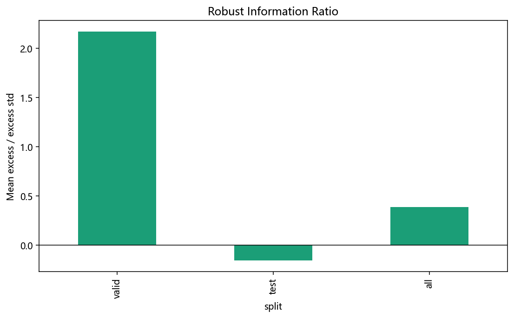

**这张图展示什么：**  
这张图用于展示稳健优化相关结果，帮助比较原模型、稳健模型或不同参数方案的差异。

**应该怎么看：**  
重点看横轴和图例中的模型、split 或参数组合，再看纵轴指标是收益、Alpha、Information Ratio、换手率还是回撤。收益和 Alpha 通常越高越好，换手率和回撤通常越低越稳。

**从图中能得到什么结论：**  
如果稳健模型在测试集 Alpha、Information Ratio、回撤或换手率上更好，说明稳健化提高了可交易性或样本外稳定性；如果收益没有提高，也要如实说明收益转化仍有限。

**需要注意什么：**  
这些图不能证明模型未来一定稳定盈利。测试期季度数量有限，所有 test 指标只能作为 holdout 检验，不能反向用于调参。


## 32. PROMETHEE 偏好函数选择与数据比较

稳健版本继续采用 PROMETHEE 作为多属性投资前景评价工具。最终偏好函数为 `linear`。本项目重点解释 linear preference function：

设 `d = g_j(a) - g_j(b)`，其中 `g_j(a)` 是股票 a 在指标 j 上的标准化得分，`g_j(b)` 是股票 b 在指标 j 上的标准化得分。

Linear Preference Function 为：

```text
P_j(a,b) = 0, 如果 d <= q
P_j(a,b) = (d - q) / (p - q), 如果 q < d < p
P_j(a,b) = 1, 如果 d >= p
```

本项目默认 `q = 0.05`，`p = 0.25`，`sigma = 0.20`。其中 sigma 只用于 Gaussian 对照，linear 不使用 sigma。

linear 偏好函数适合本项目，是因为综合因子经过标准化后是连续变量。两个股票之间差距很小时，不应该直接判定一方完全胜出；差距逐渐变大时，偏好强度也应该逐渐增加。

### 图 33：PROMETHEE 偏好函数比较

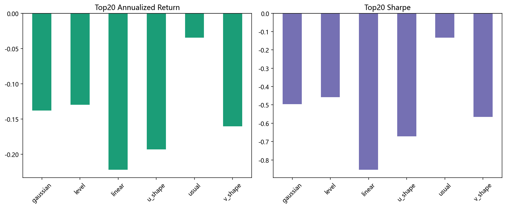

**这张图展示什么：**  
这张图用于展示稳健优化相关结果，帮助比较原模型、稳健模型或不同参数方案的差异。

**应该怎么看：**  
重点看横轴和图例中的模型、split 或参数组合，再看纵轴指标是收益、Alpha、Information Ratio、换手率还是回撤。收益和 Alpha 通常越高越好，换手率和回撤通常越低越稳。

**从图中能得到什么结论：**  
如果稳健模型在测试集 Alpha、Information Ratio、回撤或换手率上更好，说明稳健化提高了可交易性或样本外稳定性；如果收益没有提高，也要如实说明收益转化仍有限。

**需要注意什么：**  
这些图不能证明模型未来一定稳定盈利。测试期季度数量有限，所有 test 指标只能作为 holdout 检验，不能反向用于调参。


### 图 34：PROMETHEE 净流分布

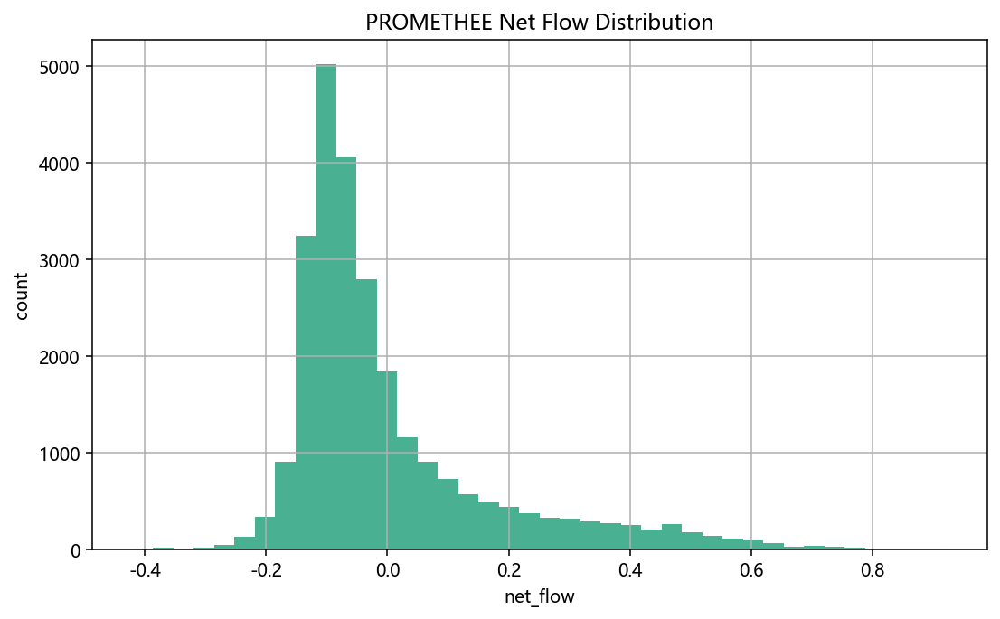

**这张图展示什么：**  
这张图用于展示稳健优化相关结果，帮助比较原模型、稳健模型或不同参数方案的差异。

**应该怎么看：**  
重点看横轴和图例中的模型、split 或参数组合，再看纵轴指标是收益、Alpha、Information Ratio、换手率还是回撤。收益和 Alpha 通常越高越好，换手率和回撤通常越低越稳。

**从图中能得到什么结论：**  
如果稳健模型在测试集 Alpha、Information Ratio、回撤或换手率上更好，说明稳健化提高了可交易性或样本外稳定性；如果收益没有提高，也要如实说明收益转化仍有限。

**需要注意什么：**  
这些图不能证明模型未来一定稳定盈利。测试期季度数量有限，所有 test 指标只能作为 holdout 检验，不能反向用于调参。


### 图 35：PROMETHEE 偏好函数验证集指标

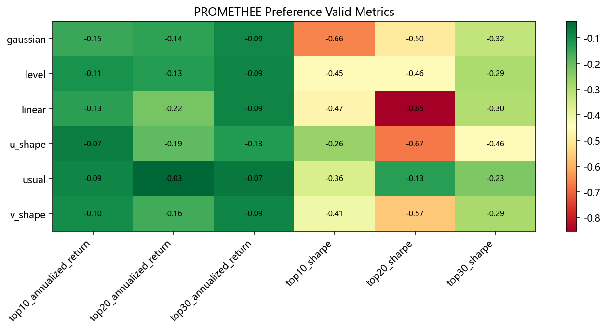

**这张图展示什么：**  
这张图用于展示稳健优化相关结果，帮助比较原模型、稳健模型或不同参数方案的差异。

**应该怎么看：**  
重点看横轴和图例中的模型、split 或参数组合，再看纵轴指标是收益、Alpha、Information Ratio、换手率还是回撤。收益和 Alpha 通常越高越好，换手率和回撤通常越低越稳。

**从图中能得到什么结论：**  
如果稳健模型在测试集 Alpha、Information Ratio、回撤或换手率上更好，说明稳健化提高了可交易性或样本外稳定性；如果收益没有提高，也要如实说明收益转化仍有限。

**需要注意什么：**  
这些图不能证明模型未来一定稳定盈利。测试期季度数量有限，所有 test 指标只能作为 holdout 检验，不能反向用于调参。


PROMETHEE-only 如果表现偏弱，不能强行写成 PROMETHEE 单独排序能力很强。更稳妥的定位是：PROMETHEE 提供多属性解释、投资前景评价、评级依据和偏好函数敏感性分析，而不是必然替代前向分步回归排序。

## 33. 稳健优化后的结论

稳健优化后的结论应根据实际指标谨慎表述。如果测试集收益、Alpha、Sharpe 或 Information Ratio 改善，同时换手率下降，可以写“样本外稳定性有所提升”。如果收益没有明显提升，但换手或回撤下降，可以写“模型更适合作为候选池筛选和投资前景评价框架”。如果测试集仍然较弱，则必须如实说明现有因子体系在测试期的收益转化能力有限。

本项目不能宣称模型可以准确预测未来收益率，也不能宣称策略稳定盈利。更合适的最终表述是：v3 稳健优化在保持前向分步回归主线的基础上，系统检查了模型复杂度、Ridge 稳健重拟合、稳定因子池、排名平滑、buffer rule、Alpha 稳定性和 PROMETHEE 偏好函数敏感性，使模型解释和风险检验更完整。

<!-- ROBUST_V3_SECTION_END -->

